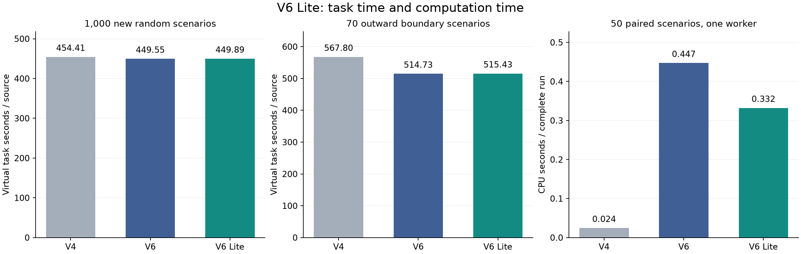
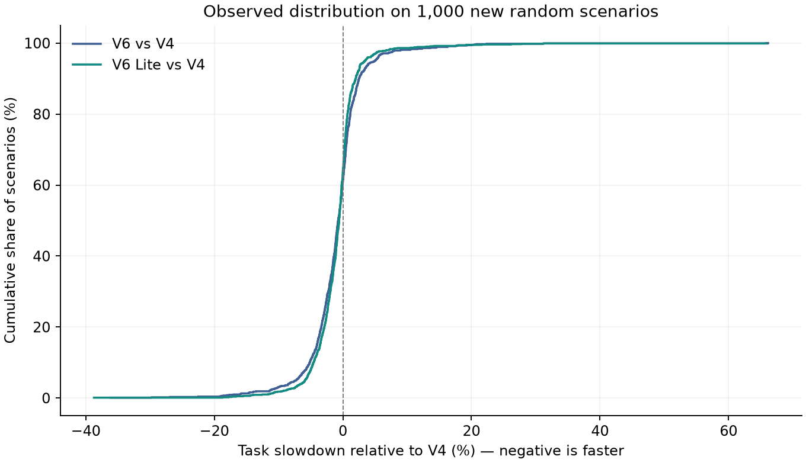

# V6 Lite 简化版独立实测

**改动：删除学习路线重排，后验共享补测评分改回 V4 启发式；保留局部前瞻、沿途学习检测和前四站保护。**

新随机场景尚不足以确认简化版的平均任务耗时有改善，也没有证明两版等价。 主测试中，原版 V6 为 449.553 秒/源，Lite 为 449.885 秒/源。Lite 减原版的配对差为 **+0.332 秒/源**，95% 区间 **[-0.428, +1.103]**；均值节时 -0.074%。

单进程 50 场复测中，CPU 时间从 0.4472 秒/场变为 0.3322 秒/场，减少 25.72%。这表示计算成本变化，与机器人移动、检测和清除的虚拟任务时间分开计量。

**使用判断：**若目标是让机器人更快完成任务，本轮不支持直接用 Lite 替代原版 V6。它可以保留为较省计算的候选；本批均值没有改善证据，且部分场景明显退步。

## 测试规模与版本

固定一个简化候选后，生成 **1,000 个新随机场景、140 个压力场景**，每场配对运行 V4、原版 V6、Lite，共 **3,420 次**。全部全清，共 14,806 个源实例、44,418 次成功清除。没有剔除失败或极端案例。

新地图与前两轮已公布的复原模拟器测试没有重叠。上一轮消融用于选择删减项；本轮数据只用于验证这个预先固定的组合，没有据此重训模型、调阈值或测试更多候选。

可部署入口为 `source_v6_lite/q4_v6_lite.py` 的 `solve_v6_lite(device, config=None)`。运行目录仅保留 18 个 Python 模块和 1 个沿途检测权重；路线模型、路线学习特征、后验共享模块和 V5 组合入口不再是运行依赖。

前瞻本身仍依赖后验位置与半径/方向推断，因此 `q4_belief.py` 和 `radius_direction.py` 继续保留。前四站保护的作用是延后沿途学习介入，不关闭早期几何定位与局部前瞻。

## 主测试：1,000 个随机场景

| 方法 | 完整任务秒/源 | 比 V4 节时 | 相对 V4 最差退步 | 相对 V4 退步的 95 分位数 |
|---|---:|---:|---:|---:|
| V4 | 454.412 | +0.000% | 0.00% | 0.00% |
| 原版 V6 | 449.553 | +1.069% | 66.15% | 4.94% |
| V6 Lite | 449.885 | +0.996% | 65.84% | 3.41% |

Lite 比原版 V6 更快 483 场、更慢 449 场、相同 68 场。最差相对原版退步 39.49%，发生在 `main-0066`。因此平均结果不构成逐场改进保证。

主指标为每场完整任务时间除以该场源数，再对场景等权平均；包括最后清除后的必要覆盖确认。主比较只有 Lite 对原版 V6 一项，使用 50,000 次同场景配对 bootstrap 的 95% 百分位区间。它不涵盖复原模拟器与官方环境之间的误差。压力分布、源数子组及尾部为探索或描述统计，不作为另外的独立主结论。

## 时间差来自哪里

| 耗时项 | 原版 V6 秒/源 | Lite 秒/源 | Lite−V6 |
|---|---:|---:|---:|
| 移动 | 325.968 | 325.159 | -0.809 |
| RF 检测 | 98.459 | 99.371 | +0.912 |
| 换频道 | 18.510 | 18.719 | +0.209 |
| 光学尝试 | 4.616 | 4.636 | +0.021 |
| 成功清除附加时间 | 2.000 | 2.000 | +0.000 |

这是逐场计时记录的均值分解。移动时间的下降被更多检测和换频道耗时抵消；它解释本批总差值，但不能把两个同时删除的组件分别归因。

最大的相对原版退步案例 `main-0066` 含 16 个源：原版最后发现频道时刻约 2729.1 秒，访问 10 个固定站；Lite 约 5375.5 秒，访问 20 个固定站。完整任务由 4070.5 秒增加至 5677.8 秒。这里的数量只在事后审计中使用，策略没有读到隐藏源数。

## 压力场景

| 分布 | 场景数 | 原版 V6 秒/源 | Lite 秒/源 | Lite−V6 秒/源 | 探索性 95% 区间 |
|---|---:|---:|---:|---:|---|
| 全定向 | 70 | 470.027 | 470.255 | +0.228 | [-2.782, +3.294] |
| 边界朝外，R=1000 | 70 | 514.731 | 515.432 | +0.701 | [+0.407, +1.068] |

两组分别包含 N=10～16 各 10 场，不混入随机主测试均值。沿途模型权重、候选点预筛、16 次停测上限、4 站保护阈值均沿用原版。

## 计算耗时

| 方法 | CPU 秒/场 | 实际墙钟秒/场 |
|---|---:|---:|
| V4 | 0.0245 | 0.0251 |
| 原版 V6 | 0.4472 | 0.4540 |
| V6 Lite | 0.3322 | 0.3357 |

冻结随机组前 50 场、每场 3 方法，共 150 次单进程复跑，并轮换方法顺序。模块、模型和布局证书预热；计入策略与本地协议处理，排除压缩、导出与事后审计。全部完整动作哈希和虚拟时间与批量运行一致。这 50 场不是额外独立测试。

## 个例退步与源数分组

| Lite 相对原版退步最大的案例 | 源数 | V4 总秒数 | V6 总秒数 | Lite 总秒数 | Lite 退步 |
|---|---:|---:|---:|---:|---:|
| main-0066 | 16 | 4441.8 | 4070.5 | 5677.8 | 39.49% |
| main-0541 | 16 | 5308.8 | 3390.9 | 4541.6 | 33.93% |
| main-0125 | 16 | 5122.1 | 3742.8 | 4710.9 | 25.87% |
| main-0137 | 16 | 6180.8 | 5028.8 | 6254.7 | 24.38% |
| main-0902 | 16 | 5482.8 | 4444.8 | 5433.3 | 22.24% |

极值和分位数只是本批观测，不能证明总体尾部风险受控。

| 实际源数（只用于事后分组） | 场景数 | V6 秒/源 | Lite 秒/源 |
|---|---:|---:|---:|
| 10 | 151 | 582.405 | 582.810 |
| 11 | 141 | 533.086 | 531.146 |
| 12 | 142 | 479.758 | 479.928 |
| 13 | 139 | 444.230 | 443.843 |
| 14 | 136 | 408.407 | 410.052 |
| 15 | 146 | 378.949 | 378.448 |
| 16 | 145 | 315.181 | 318.102 |

## 验证与复现

- 5 项测试通过：删减组合与消融控制器完整轨迹等价、前瞻与沿途机制保留、后验异常仍完成几何清除、独立运行无已删除模块依赖、非法配置拒绝。
- 3,420 场完整会话重放一致，共 951,142 条动作，逐反馈与微秒时钟核对通过。
- 运行前后核对源码、模型与配置哈希；触发 120 秒规划墙钟预算的运行数为 0。
- 策略只接收公开测量与清除反馈，不接收真实位置、半径、方向、剩余源数或场景种子。
- 保留 21 站连续覆盖证书；少于 16 个源时审计全部未发现频道的 21 站检测，16 个源时审计 16 次真实清除成功。
- 批量运行使用 4 个工作进程，耗时 388.1 秒；不把并行墙钟计作机器人任务时间。
- 本轮只有本地复原模拟器验证，没有官方演练、正式测试或官方端到端一致性证明。

运行与复现命令见 `README.md`。`plan.json` 保存冻结地图，`source_hashes.json` 保存冻结文件哈希，`summary.json` 与 `paired_records.csv` 保存统计和逐场数据，`main/sessions/*.json.gz` 保存完整会话。

简化版作为独立目录交付；既有 V6 与历史消融记录保留。本轮结果适用于这里冻结的配置和本地场景生成机制。
