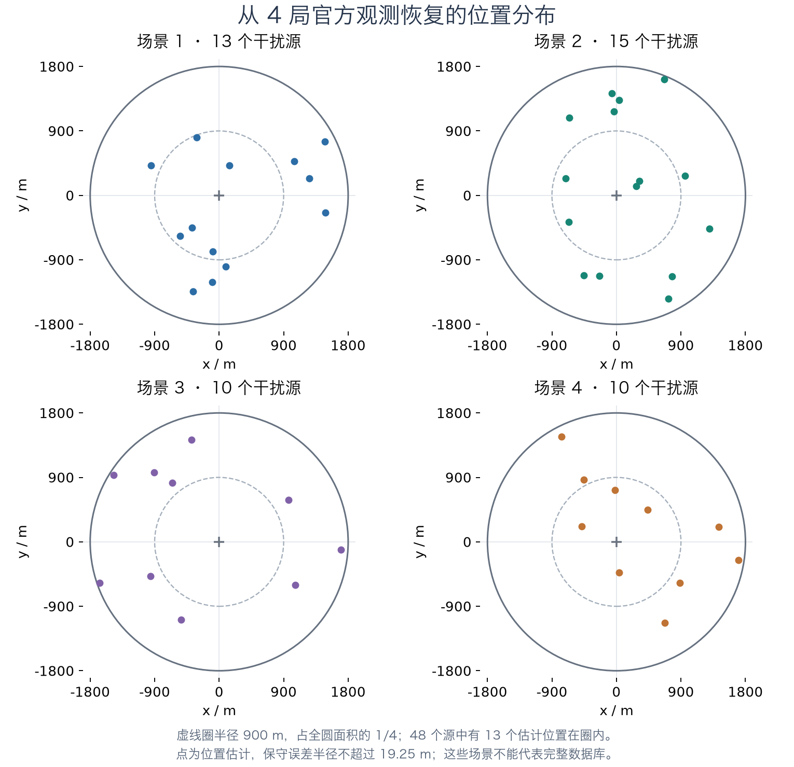

# 官方地图分布：当前证据

核查时间：2026-09-12。GitHub 主分支固定在 `e37311bf0b5d28b833bde42c7ab234ef73a7cafc`。

目前没有足够证据证明官方点集非均匀，或来自某一 TSP 点集生成分布。TSP 本身不指定点集分布；相关研究既使用均匀随机点，也使用聚簇随机点和真实地图。参见[研究作者的实例说明，第 4.1 节](https://www.dbai.tuwien.ac.at/user/pihera/tsp/article.pdf)。

## GitHub 保存了哪些数据

仓库[固定清单](https://github.com/Sa63R/cumcm2026-b-interference-localization/blob/e37311bf0b5d28b833bde42c7ab234ef73a7cafc/docs/evaluation/official-practice-audit-v1.json)登记第三问 436 局、第四问 436 局，共 872 局官方演练轨迹。这是已提交清单的计数，本轮没有直接打开该数据库核验或刷新实际采集进度。

完整库的位置是 `results/practice_batches/rl-dataset-20260911/practice_training.sqlite3`，目录被 Git 忽略。数据库格式包含逐动作观测及 `source_estimates`：估计坐标、误差半径和清除依据；这些坐标不是官方隐藏真值。[采集说明](https://github.com/Sa63R/cumcm2026-b-interference-localization/blob/e37311bf0b5d28b833bde42c7ab234ef73a7cafc/资料汇总/强化学习演练数据采集.md)明确了这一点。

主分支另保存第三问 40 局和新 50 局、第四问若干批次的脱敏汇总。它们主要含源数、耗时和下界，没有逐源坐标，不能据此检验空间聚簇或模板。不同汇总和数据库清单可能有包含关系，本轮不将它们相加成独立样本总量。

此前本地策略实验的 `src/simulation/cases.py` 用固定种子的自建伪随机生成器，按圆盘面积均匀产生位置；它明确只是研究假设，不是已查明的官方地图生成器。

## 本轮实际检查的四局

本地 `code/experiments/q3_official_practice/results/q3_evidence_partial.zip` 有 4 个独立第三问官方演练记录，其副本不重复计数。共 572 次物理测量、48 次成功清除。它不是上面的 872 局数据库，且所在目录目前未被原 code 仓库跟踪。

根据合法测向、near 与清除记录重建源位置外包区域：误差半径中位数 12.16 米、最大 19.24 米。下面的点是估计中心；图中小范围几何误差远小于整张地图尺度。

全圆半径为 1800 米。若按面积均匀分布，半径 900 米以内占面积 1/4，48 个点的期望数量为 12；本样本有 13 个估计中心在该范围内。面积均匀不意味着半径本身均匀：应检查 `u=(r/1800)^2` 是否近似均匀。

按每局实际点数 13、15、10、10 固定，产生 10000 组纯统计用的面积均匀参考点集。每局作为独立单位；下列汇总对四局等权，未把所有点对当作独立样本。没有运行策略或调用官方模拟器。

| 指标 | 观测估计 | 位置不确定性传播后的范围 | 均匀参考的中央 95% 范围 |
|---|---:|---:|---:|
| 各局平均 r²/R² 再平均 | 0.4553 | 0.4475—0.4632 | 0.4183—0.5827 |
| 各局最小点间距再平均 | 258.2 m | 236.0—280.4 m | 107.2—315.2 m |
| 各局平均最近邻距离再平均 | 506.2 m | 483.4—529.1 m | 437.8—616.1 m |

径向 KS 的探索性 p 约 0.278，平均最近邻统计的 p 约 0.643。20 项探索比较保留完整结果并做 Holm 校正；没有拒绝面积均匀独立点的证据。10000 次参考计算并没有把真实样本数从 4 局增加。

逐局最小估计点间距约为 202、84、291、455 米。有局局部较近，也有局较疏；15 源局最近一对源的真实距离保守上界为 105.6 米，足以排除“官方始终强制所有点至少相隔 200 米”这一强假设，但不能排除更小的间距约束。

同样，这四局跨局的成功清除点两两最小距离为 79.29 米，大于两次清除的 20+20 米半径，能排除这四局中任何两个源复用完全相同的绝对坐标。尚未检验旋转、缩放或从大型固定点库抽取的模板；不能因此排除这些机制。

## 结论边界

当前只能说：这四局的径向和近邻特征没有显示出足以认定非均匀的证据。不能证明官方均匀，也不能确定 PRNG 类型、种子、TSPLIB 来源或未来位置。地图样本少、纳入方式未知、位置来自带误差的估计，均限制推断。

要检查聚簇、方位偏好、点间距约束或重复模板，需要原库的逐局位置区域及采集批次信息，按地图而非单个点作统计单位。位置估计应携带误差界；可以验证分布假设，不应将拟合出来的假设直接称为官方生成规则。本轮没有修改求解策略，也没有把这些观测拟合成策略先验。

原始脱敏盘点见 `official_observation_inventory.json`，完整统计及数值约定见 `distribution_reference.json`，估计坐标见 `estimated_maps.json`。`distribution_reference_original.py` 保留生成统计时的原脚本，其输入输出路径是原 `/tmp` 路径；这些来源文件一并归档。
