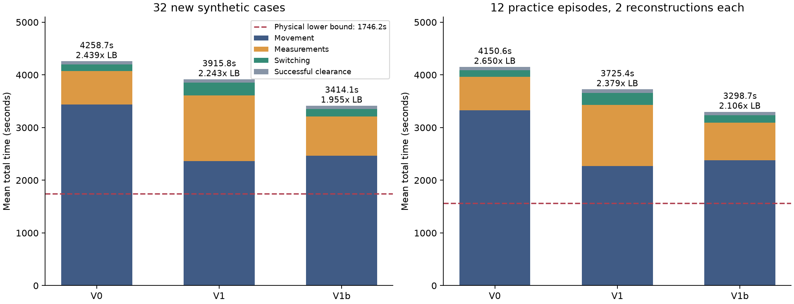
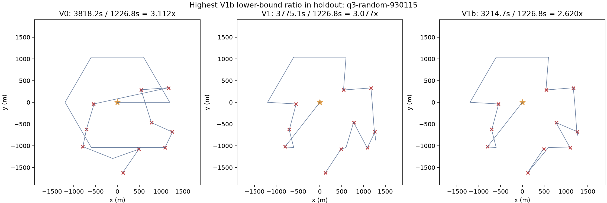

# B题第三问：从零策略第一轮实验与交接报告

日期：2026-09-12。分支：`research/q3-from-scratch-v0-v2`。策略冻结提交：`01fbea52`；首次 V0/V1 实现提交：`17a1c4bb`。

[GitHub 分支与完整仓库](https://github.com/Sa63R/cumcm2026-b-interference-localization/tree/research/q3-from-scratch-v0-v2)。交接压缩包包含报告、结果、轨迹和关键代码；完整运行依赖以仓库为准。

本轮已经把“七点发现—可行区域—保证清除”的 V0 做成可运行基线，实现 V1 联合路线，并根据耗时分解增加 V1b 测量调度。冻结后，V1b 在 32 个新合成案例中全部清除，平均 3414.10 秒，物理下界平均 1746.17 秒，比值 1.955；比 V0 平均快 19.83%。在从验证库选出的 12 个案例、每例两种接收半径重建中，V1b 平均 3298.74 秒，相对包含位置不确定性的物理下界为 2.106 倍，比 V0 快 20.52%。

**这是一轮从零建立基线并验证改进方向的研究结果。尚未实现 V2 rollout、尝试清除或 V3 场景树；也没有证明这个分支优于其他既有分支。分支名中的 v0-v2 表示后续路线，不表示 V2 已完成。** 希望 GPT Pro 基于以下证据决定下一轮。

**1．任务边界与执行条件**

目标是保证全部清除和正确终止，再降低最后任务完成时的总虚拟时间。自由终点，无返回原点要求。没有用平均首次清除时刻或提前退出优化分数。

使用公开动作成本：

\[
T=L/5+5N_{measure}+N_{switch}+5N_{success}+3N_{fail}.
\]

成功清除的 5 秒已包括光学定位和激光清除；清除动作不切换当前测向频道。每个频道的无信号证据独立保存。

本轮没有调用正式测试，也没有新开官方演练，避免干扰正在运行的数据采集。性能实验使用用户指定的 4060 主机，只运行 CPU 进程，同时最多两个，不使用 GPU或强化学习主机。代码与结果通过指定对象存储目录交换；SSH 仅启动命令，未用 SSH/SCP 传文件。每完成一组配对案例上传进度。没有使用额度重置卡。

“从零”的边界：策略决策重新实现，未读取既有策略的优胜参数、模型权重或成功路线。复用已有的客户端、通用几何计算、公开规则本地引擎、测试案例生成工具和下界 DP。这避免重写基础设施造成不可比的物理规则，不意味着从空仓库重造所有代码。没有写论文。

**2．实际实现，与原提案的差别**

| 版本 | 实际内容 | 本轮角色 |
|---|---|---|
| V0 / `v0` | 原点加半径 1200 米六点；先搜索，再按估计距离清除；有限扇区交集、最小包围圆、中心逼近和减半保底 | 固定基线 |
| V1 / `v1` | 未完成覆盖点与已发现源合并为一个开放路线；最近邻构造后 2-opt；在清除/定位停点顺路测量；逐频道动态覆盖；最近保证清除点 | 首次联合规划 |
| V1b / `v1_selective` | V1 加选择性测量：固定覆盖点的 Voronoi 责任区、只有能完成至少一个责任区时才顺路扫未知频道、已知源按名义几何收益筛选补测 | 本轮选定继续开发版本 |

V0 的七点覆盖有解析保证。发现 16 个不同频道后利用源数上界终止额外发现；只有 10、12 或 14 个时仍须排除其他频道。所有已发现源清除、全部未知频道有覆盖证明或数量上界证明后，才显式退出。

可行区域使用外包多边形，源区域初始半径 1800 米、正向测量接收上界 1500 米。测向带采用 ±1.005°，比提案的 ±1° 多留半个 0.01°量化单位。该选择更保守，不靠提高精度假设获得成绩。源区域圆盘采用 128 边外包，覆盖证书采用 64 边外包；对圆的近似方向不反转。

区域的最小包围圆半径不超过 `20-1e-5` 米时才保证清除。V0 去圆心；V1/V1b 在所有顶点的半径 20 米圆的交集中寻找离机器人最近的点，枚举机器人位置、单圆径向投影和两圆交点，再检查全部源区域顶点。没有把“直径小于 40 米”当成充分条件。

前两次局部探测使用可行区域包围圆中心，其后用显式减半保底：从最近正向测量点沿测得方向移动 `R/(2*cos(1.005°))`，随后加入对应的距离上界圆盘。七步可把 1500 米上界压到约 11.7 米；实际满足保证清除条件即停。程序设置 18 次局部循环保护，超出就报告异常，不能伪装成功。

动态覆盖证明：对某频道的无信号位置构造最近点 Voronoi 单元，用外包场地多边形裁剪，在每个单元的顶点检查距相应无信号点不超过 1000 米。距离函数在凸多边形上的最大值由顶点控制，所以这是连续区域证书，不是网格抽查。V1b 将原七点的 Voronoi 单元作为覆盖责任区，避免要求顺路测量覆盖一个完整的半径 1000 米圆。

V1b 的已知源补测筛选是假定目标在当前包围圆中心，预测一次补测后的区域；预测能达到保证清除，或包围半径至少缩小 30 米，才支付共享补测成本。30 米来自切换加测向 6 秒的等价移动距离。这只是调度启发式，预测结果不进入实际可行区域，更不能直接作为清除证明。未知频道顺路测量还保留与此前无信号点至少 350 米的间隔条件。

相对原提案尚未完成的内容：

- 联合路线仍以源的估计中心代表任务点，2-opt 只优化估计移动距离，没有完整计算测向、切换、定位余程和未来发现。
- 目前在动作停点顺路测量，没有在每条移动线段上连续优化新的观测点。
- 一旦进入单源定位子程序，通常处理到该源清除才重新规划全局路线，没有每一步都全局重排。
- 已发现源的无信号记录没有全部转为非凸源区域裁剪；主要用于未知频道覆盖。存在进一步利用负观测信息的空间。
- 没有尝试清除候选动作，本轮所有清除都有几何保证，因此失败清除为零。
- 没有条件场景采样、完整策略 rollout、场景树或强化学习，也没有用验证库拟合分布。

**3．实验协议与数据划分**

开发集为 24 个合成案例：12 个均匀面积随机源位置、均匀接收半径案例，种子 910100–910111；以及 12 个压力案例。压力情况包括半径 1800 米边界、全部 1000 米接收半径、极端正负测向误差、位置固定的交替误差、紧密聚集源、近共线源、16 个旋转边界源及平滑空间相关误差。均匀分布只是一种研究假设，不被当作官方生成规律。

第一轮在开发集运行 V0、V1、关闭动态覆盖的 V1、回到圆心清除的 V1，合计 96 次策略运行。发现 V1 扫频明显增加后，第二轮仍在同 24 个案例比较 V0、V1、V1b，合计 72 次。

之后冻结策略，在种子 930100–930131 的 **32 个新合成案例**上比较 V0/V1/V1b，合计 96 次。这些种子没有用于选择调度方案或阈值。

验证库位于用户指定的 `practice_training.sqlite3`。只读事务取得快照时，其中第三问有 436 个完整案例。忽略库内 train/validation/test 标签，全部视为禁止拟合的验证数据。按 `SHA256("fresh-q3-v1:" + case_code)` 排序取前 12 个，选择规则不依赖策略表现，无跳过失败重建的换样：12 个均成功重建。

库内标签是有范围的位置估计，不是精确真值。因此先在标签多边形中找与历史正向、near、无信号、清除结果一致的位置见证点，再据历史观测约束得到可用接收半径区间。每个案例分别取区间内部的 25% 和 75% 位置作为两种半径，形成 **24 个重建场景，仍只有 12 个原始案例单位**。同一个位置的历史反馈被固定；新位置反馈使用公开规则研究引擎。源位置不确定性包围半径约 0.336–7.940 米，已计入单独的保守下界。

这些数据只传入评估器，不传入策略。重建验证不是原官方地图的精确反事实重放；新的误差场和未识别参数仍不确定，模拟耗时不能冒充官方实测耗时。数据库中的原策略是 `efficient+bounded_refinement`；其原成绩保留为来源信息，没有拿它与新模拟成绩直接宣布胜负，也没有称其为当前最优状态搜索策略。

四个批次共 336 次策略运行。开发集重复比较不能当成新增独立案例。合计场景为 56 个不同的合成案例，以及 12 个验证库原始案例的 24 种重建场景。

**4．理论下界的精确定义**

沿用仓库此前的“起点固定、终点自由、访问清除圆”的边距离放松，用精确子集 DP 求开放 Hamilton 路径最小边权和。合成案例的评估真值为源中心 `s_i`：

\[
d_{0i}=\max(0,\|s_i\|-20),\quad d_{ij}=\max(0,\|s_i-s_j\|-40).
\]

\[
LB_{physical}=\min_{\pi}(d_{0,\pi_1}+\sum_k d_{\pi_k,\pi_{k+1}})/5+5N.
\]

代码扣除微小数值余量。DP 对边权问题求精确最优，但不同边上的最近接触点可能不兼容，所以这是实际圆盘访问路径的可靠放松下界，不是可执行最优路线。没有把近似可行路线误称为下界。

另外报告要求保证全清时的更强条件下界：源数小于 16 时，加入每个空频道至少 30 秒动作费的圆周覆盖放松；源数为 16 时不加。它来自原有 `empty_channel_action_bound(3)`，也仍不是可达最优时间。

验证重建同时报告两种物理下界：一是把重建见证点当作该合成世界真值的下界；二是扣掉位置标签不确定性。第二种中，原点边再减 `r_i`，源间边再减 `r_i+r_j`，因此对允许范围内的位置更保守。

表中“倍数”默认为 **平均总时间÷平均下界**。`all_runs.csv` 每行保存对应单例下界与倍数；`analysis.json` 另有逐例比值的平均值，二者没有混用。物理下界省去了发现、测量和完整性证明，因此 1.95 倍不意味着剩余 49% 都能通过更好的路线消除。

**5．主要结果**

开发集结果，下界平均 1843.87 秒；加入空频道必要动作费后为 1988.87 秒。

| 策略 | 全清且证书正确 | 平均总时间/秒 | 平均时间÷物理下界 | ÷含确认动作下界 | 对 V0 平均节省 |
|---|---:|---:|---:|---:|---:|
| V0 | 24/24 | 4602.70 | 2.496 | 2.314 | — |
| V1 | 24/24 | 4017.11 | 2.179 | 2.020 | 12.72% |
| V1b | 24/24 | 3576.47 | 1.940 | 1.798 | 22.30% |

V1 对 V0 为 21 胜、3 负；V1b 对 V0 为 24 胜、0 负。V1b 对 V1 为 22 胜、2 负，说明选择性测量并不逐例占优。

冻结后的 32 个新合成案例，下界平均 1746.17 秒；含确认动作下界为 1948.67 秒。

| 策略 | 全清且证书正确 | 平均总时间/秒 | 物理下界倍数 | 含确认动作下界倍数 | P95 总时间/秒 | 最慢/秒 |
|---|---:|---:|---:|---:|---:|---:|
| V0 | 32/32 | 4258.73 | 2.439 | 2.185 | 4834.05 | 4969.99 |
| V1 | 32/32 | 3915.82 | 2.243 | 2.009 | 4389.36 | 4588.90 |
| V1b | 32/32 | 3414.10 | 1.955 | 1.752 | 3893.96 | 3910.39 |

V1b 对 V0 平均少 844.63 秒，快 19.83%，32 胜、0 负，最小节省仍有 541.60 秒。按案例做 5000 次配对 bootstrap，平均差值的描述性 95% 区间为 [-896.63, -793.78] 秒；这只描述当前合成分布的有限样本，不能外推为官方分布置信保证。

V1b 对 V1 平均少 501.72 秒，31 胜、1 负。

验证库的 24 个重建场景，见证点世界的物理下界平均 1579.46 秒；加入位置不确定性后的保守物理下界平均 **1566.11 秒**。

| 策略 | 全清且证书正确 | 平均总时间/秒 | ÷见证点物理下界 | ÷不确定性保守物理下界 | P95 总时间/秒 |
|---|---:|---:|---:|---:|---:|
| V0 | 24/24 | 4150.58 | 2.628 | 2.650 | 4566.15 |
| V1 | 24/24 | 3725.38 | 2.359 | 2.379 | 4137.10 |
| V1b | 24/24 | 3298.74 | 2.089 | **2.106** | 3645.33 |

V1b 对 V0 平均少 851.84 秒，快 20.52%。按原始案例将两个重建版本先平均，12 个案例全部改善；按这 12 个组进行配对 bootstrap，描述性 95% 平均差值区间为 [-1013.24, -700.84] 秒。两个半径版本不计为 24 个独立观测。较低半径版本 V1b 平均 3336.08 秒，较高半径版本 3261.40 秒；二者使用相同的平均物理下界 1579.46 秒，比值分别约 2.112 和 2.065。

本轮全部 336 次策略运行均全清、显式正确退出，清除失败数为零。

**6．为什么 V1b 更快：把收益拆开看**

32 个新合成案例的平均时间分解：

| 策略 | 移动/秒 | 测向/秒 | 切换/秒 | 成功清除/秒 | 总时间/秒 | 测量次数 | 物理下界/秒及倍数 |
|---|---:|---:|---:|---:|---:|---:|---|
| V0 | 3434.58 | 639.53 | 120.88 | 63.75 | 4258.73 | 127.91 | 1746.17；2.439 |
| V1 | 2359.95 | 1247.03 | 245.09 | 63.75 | 3915.82 | 249.41 | 1746.17；2.243 |
| V1b | 2462.01 | 745.94 | 142.41 | 63.75 | 3414.10 | 149.19 | 1746.17；1.955 |

V1 确实减少了约 1074.63 秒移动，但多付约 731.72 秒测向与切换，净收益只有约 342.91 秒。这说明“停在同一个位置顺便多测几个频道”并非免费。

V1b 相对 V1 多走约 102.06 秒，却少付约 603.78 秒测向与切换，净省约 501.72 秒。收益来自减少收费观测，而不是更短的移动路线。相对 V0，V1b 仍大幅减少移动，但也支付了更多观测费用。

V1b 在留出集平均移动时间约占 72.1%，因此移动仍然值得优化；同时不能把测量调度重新放开，否则会吃掉路线收益。平均真实策略计算时间约 0.105 秒/例，最大约 0.142 秒/例；不含离线求下界和对象存储同步。当前瓶颈不是搜索计算预算，尚有尝试小规模 rollout 的空间；该计时只代表本次主机与实现。



图右侧使用含位置不确定性的保守物理下界，因而 V1b 标为 2.106 倍。

开发集两个消融版本：关闭动态覆盖的 V1 平均 4044.91 秒，物理下界 1843.87 秒、2.194 倍；使用圆心清除的 V1 平均 4091.84 秒，同一下界、2.219 倍。完整 V1 为 4017.11 秒、2.179 倍，分别改善 27.80 和 74.73 秒。这里只能解释整体轨迹改变的净效应，不能认为每一处几何投影都直接省了同样时间。

**7．退步与困难案例必须保留**

| 案例 | V0/秒 | V1/秒 | V1b/秒 | 物理下界/秒 | V0 / V1 / V1b 下界倍数 |
|---|---:|---:|---:|---:|---|
| 开发集：边界源 `q3-hard-boundary_outward` | 4777.89 | 4919.15 | 4024.37 | 2377.85 | 2.009 / 2.069 / 1.692 |
| 开发集：紧密聚集 `q3-hard-close_targets` | 2340.97 | 2073.72 | 2020.46 | 249.80 | 9.371 / 8.302 / 8.088 |
| 开发集：近共线 `q3-hard-near_parallel` | 5415.14 | 2375.56 | 2575.32 | 266.00 | 20.358 / 8.931 / 9.682 |
| 留出集：`q3-random-930107` | 4492.26 | 3887.69 | 3893.96 | 1933.05 | 2.324 / 2.011 / 2.014 |

V1b 在近共线案例比 V1 慢 199.75 秒。对最后一行，它少付 527 秒测向与切换，却多走 533.28 秒，净慢 6.28 秒。这恰好暴露名义局部信息阈值的局限：某次补测看似不够值钱，可能使之后路线更差。

紧密聚集案例只有 14 个源，V1b 已经清完源后又花 **1284.14 秒**完成未知频道排除；总时间 2020.46 秒。近共线案例同样有 14 个源，确认拖尾 **1364.84 秒**，总时间 2575.32 秒。它们的含确认动作下界分别为 429.80、446.00 秒，相对该下界仍约为 4.701、5.774 倍。

这类地图的物理下界非常小，因为知道所有源位置后几乎可直接去一个区域清除。然而在线算法仍必须证明其他区域不存在第 15、16 个源。因此，8–10 倍的物理下界比值不能全部解释为路径规划很差；既有必要的信息获取成本，也可能有固定覆盖点造成的浪费。需要更强的覆盖/信息下界辅助判断。

V0 的“最后一次清除后确认拖尾”为零，是因为它先完成搜索确认，不能因此声称 V0 没有确认成本。V1b 在留出集平均确认拖尾为 43.07 秒，在重建验证为 98.26 秒，均掩盖了上述特殊分布的长拖尾。

留出集 V1b 的最高下界比值案例为 `q3-random-930115`：总时间 3214.74 秒，下界 1226.83 秒，2.620 倍。三个版本在同一地图上的路线如下；目标真值仅用于完成后的绘图。



**8．检查、可复现材料与局限**

相关单元/集成测试共 **88 项通过**，覆盖七点连续覆盖、少一扇区不能终止、逐频道证据、16 源上界、直径判据反例、最近保证清除点、极端角误差下的减半收缩、开放路线、重复位置固定误差、清除不切频道、重建半径约束、历史反馈锚定及策略无真值/数据库依赖。

此外，独立后处理检查全部 336 条执行轨迹：按每一步坐标重新累计移动、测量、切换和清除费；检查所有测向/near/无信号是否符合对应评估世界及误差带；检查每次清除距评估目标不超过 20 米；检查没有相同频道相同坐标重复测量；检查最终清除集合等于该世界全部源。所有源代码摘要在每个批次前后保持一致。校验是对有限样本的工程证据，不等于形式化证明所有浮点计算情形。

入口和证据：

- `src/strategies/q3_fresh.py`：V0/V1/V1b 策略。
- `experiments/run_q3_fresh.py`：成对实验和统一下界。
- `experiments/export_q3_fresh_validation.py`：只读验证库重建。
- `experiments/analyze_q3_fresh.py`：逐动作审计、配对统计、图表。
- `research/q3_fresh_round1/all_runs.csv`：336 次逐例结果，含每例下界与倍数。
- `research/q3_fresh_round1/analysis.json`：全部聚合统计和配对差值。
- `results/q3_fresh/{development,scheduling,holdout,validation}/results.json`：批次清单、源代码哈希和原始数值。
- 同目录 `trace-*.json.gz`：全部动作轨迹、证明终态和评估世界。
- `development/source/` 与 `scheduling/source/`：与运行哈希匹配的实际代码快照；后者也是留出与重建验证所用代码。
- `results/q3_fresh/validation/frozen-input.json`：冻结后的匿名重建输入，历史反馈仅保留测量结果与方位。

复现实验命令，在该分支仓库根目录执行；输出目录必须尚不存在：

```bash
python -m pytest tests/test_q3_fresh.py tests/test_q3_fresh_experiment.py tests/test_geometry.py tests/test_localization.py tests/test_simulation.py -q
python -m experiments.run_q3_fresh --out results/q3_fresh/reproduce-development --start 910100 --count 12 --hard --configs v0 v1 v1_selective
python -m experiments.run_q3_fresh --out results/q3_fresh/reproduce-holdout --start 930100 --count 32 --configs v0 v1 v1_selective
python -m experiments.run_q3_fresh --out results/q3_fresh/reproduce-validation --cases results/q3_fresh/validation/frozen-input.json --configs v0 v1 v1_selective
python -m experiments.analyze_q3_fresh
```

最后一条重建已归档批次的报告，不自动纳入新命名的复现目录。本轮测试不是原始采集库所有 436 例的穷举，也不是官方演练成绩。合成留出仍以均匀位置/半径为主；压力分布案例数有限。验证重建只选一个兼容位置见证点并改变半径，还没有对全部允许源位置与未知误差场做敏感性分析。

**9．我的判断，以及希望 GPT Pro 决策的下一步**

这一轮支持原提案的主线：联合路线有收益；同时必须把测量费放进决策。最有说服力的证据不是最好案例，而是冻结后的 32 个合成留出案例和 12 个验证库案例组，V1b 对 V0 全部改善，平均约节省五分之一。继续开发时建议保留 V0 做证书与保底对照，保留 V1 捕捉“补测减少却造成绕路”的反例，以 V1b 作为候选默认后续策略。

下一轮优先考虑一个有限范围的 V2：候选动作只包括完成一个已知源、先到一个必要覆盖责任区、在共享位置补测一个频道束，以及有条件的尝试清除；由 V1b 完整执行剩余任务来估计代价，只执行真实第一步。采样场景必须由当时公开历史生成，并固定同位置误差；模拟策略不得读取假设世界的隐藏真值。场景采样失败或计算超时时回退 V1b，不能降低终止条件。暂时没有证据需要直接上深场景树或强化学习。

但在紧密聚集/近共线地图上，未知频道覆盖拖尾大到足以改变优先级。因此希望 GPT Pro 针对以下问题给出下一轮的具体实验安排：

1. 是先做一层完整任务 rollout，还是先把固定七点责任区的尾部覆盖改成可移动的连续覆盖路线？请给出一种最小可检验改动和明确对照。
2. 如何估计“未知频道的观测动作对最终完成时间的价值”，避免 V1 过度扫描，也避免 V1b 在 `930107` 与近共线案例中错过有益补测？
3. 对半径约束和位置可行区域生成条件场景，第一版应该采用怎样的简单假设及跨假设评估，才能不把官方分布未知的问题隐藏起来？验证库不能参与拟合。
4. 尝试清除是否值得在本轮之后优先引入？若引入，希望给出成功/失败后续代价的比较办法，而不只是固定置信阈值。
5. 能否给一个比当前“清除圆访问＋空频道动作费”更强、同时可靠的发现/确认移动下界，特别用于紧密聚集场景？否则物理比值会把必要搜索成本和可优化浪费混在一起。
6. 下一轮建议的计算预算、案例规模、保留/否决阈值是什么？当前 V1b 单例策略计算约 0.1 秒；收益比较应继续使用同例总完成时间、全清证书、P95/最慢案例及两类下界。

目前没有需要用户解除的技术阻塞。此处停在一个已冻结、已验证、已提交的实验轮次，供 GPT Pro 审阅后决定下一轮，而不是把尚未实现的 rollout 当作成果。
