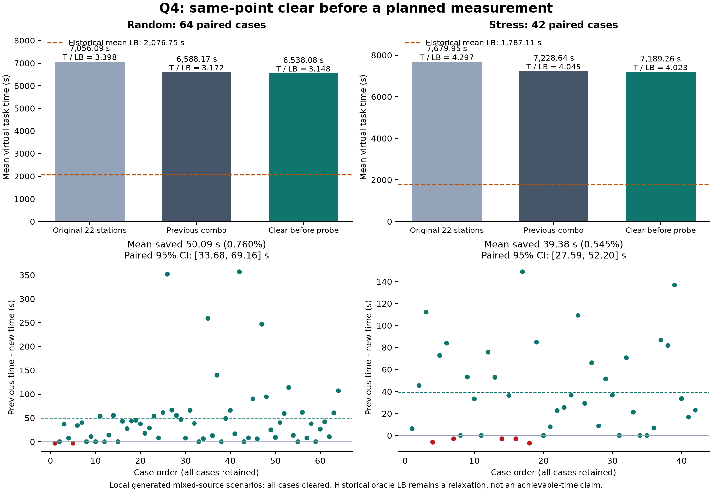

# 同点先清除再测向：独立验证通过

`compact_clear_before_probe` 达到预先登记的通用晋级条件，作为后续研究的新比较基准。它相对上一合格版本 `compact_combo` 的独立随机平均改善为 **0.7603%**，压力平均改善为 **0.5448%**。这是稳定的小改进，不能据此宣称原题最优或所有场景必然提速。所有结果来自本地生成场景，尚无本候选的官方演练成绩。

策略源码冻结提交 `84773a1`；开发后唯一候选选择提交 `6d7ab88`，之后才打开预留的独立场景。判定记录见 [qualification.json](qualification.json)，逐局真实动作、费用和历史下界保存在 `results/q4_clear_before_probe/`。源码与审计器未在独立测试中调整，阈值没有扫描或重新拟合。

图可用 `python experiments/plot_q4_clear_before_probe.py` 从冻结结果重新生成，另有同名PDF用于导出。

## 配对独立结果

下表比值始终为 **平均实际虚拟用时 T / 平均历史共同下界 LB**。LB 仍使用此前的已知真值放松下界；它没有计入未知源的全部探索困难，不能把与它的剩余差额全部解释成算法浪费。逐局比值及其平均值另存在 summary.json，不能和表中比值混用。

| 集合 | 方法 | 平均T/秒 | 平均LB/秒 | T/LB | 全清 |
|---|---|---:|---:|---:|---:|
| 独立随机64 | 原22站 compact_baseline | 7056.094615 | 2076.754032 | 3.397655 | 64/64 |
| 独立随机64 | 上一版本 compact_combo | 6588.173677 | 2076.754032 | 3.172342 | 64/64 |
| 独立随机64 | 同点先清除 | 6538.080960 | 2076.754032 | 3.148221 | 64/64 |
| 独立压力42 | 原22站 compact_baseline | 7679.947859 | 1787.114500 | 4.297401 | 42/42 |
| 独立压力42 | 上一版本 compact_combo | 7228.639018 | 1787.114500 | 4.044866 | 42/42 |
| 独立压力42 | 同点先清除 | 7189.259043 | 1787.114500 | 4.022831 | 42/42 |

随机场景平均节省 **50.092717秒**，配对 bootstrap 95% 区间 **[33.675031, 69.156237]秒**；52胜、2负、10平。P95(T) 从 7726.073687 降到 7651.279785 秒，二者比值 0.990319。压力场景平均节省 **39.379976秒**，区间 **[27.593975, 52.203334]秒**；31胜、5负、6平。P95(T) 从 9903.064711 降到 9864.150588 秒，比值 0.996070。

两组全部清除、全部审计通过；随机改善超过登记的0.5%，平均节省区间下端为正，压力均值不劣，两组P95比值不超过1.05。因此资格通过。这里的P95比值是两种方法各自的耗时P95之比，不是逐局 T/LB 的P95，也没有对每一局提供变快保证。

## 改了什么、为何有效

原定位器有时已经走到了候选区域的最小包围圆中心，仍按原流程先测量。本候选只在原来就选定这个中心、19.9 < r ≤ 40米、真实已发现且未清除、没有near证据、该源尚未尝试过且失败续测预算完整时，插入一次真实clear。成功就结束该源；失败真实支付3秒，再执行原同点测量。覆盖站、任务调度、原测点选择和完整光学兜底仍由原流程提供。清除失败不会伪造成测向或用来裁剪原凸区域。

独立随机共有137次真实尝试，126成功、11失败；另1次因预算不足跳过。压力共有115次尝试，76成功、39失败，没有预算跳过。成功率分别91.97%与66.09%，只是本次已触发子集的描述统计，不是对未知官方分布的校准概率。源码没有读取这些比例作决策。

同点成功至少有机会省去一次5秒测量，失败额外3秒，固定后续行为时局部费用模型为 `8p−3`。独立费用分解显示随机平均减少移动29.045842秒、检测19.375000秒、换频2.093750秒，同时增加光学0.421875秒；压力分别减少移动20.189499秒、检测20.119048秒、换频1.428571秒，同时增加光学2.357143秒。收益主要来自更早结束定位及随之减少的移动和测量，而非减少必要的成功清除费用。

局部条件检查的独立平均CPU耗时约为随机0.00001587秒、压力0.00001719秒/登记事件；该指标不含网络等待，也不等于整局运行时间。实验整局本机平均运行约0.089秒和0.073秒，表中几千秒则是机器人移动/测量累计的虚拟任务时间。

## 退步与限制

| 独立退步案例 | combo T/秒 | 新方法T/秒 | LB/秒 | T/LB旧→新 |
|---|---:|---:|---:|---:|
| 617101 | 6376.166657 | 6379.166657 | 2099.822303 | 3.036527→3.037955 |
| 617105 | 5532.214205 | 5535.214205 | 2030.561265 | 2.724475→2.725953 |
| 617204 | 5935.340803 | 5941.340803 | 765.958147 | 7.748910→7.756743 |
| 617207 | 6802.387948 | 6805.387948 | 2308.403811 | 2.946792→2.948092 |
| 617214 | 7075.379841 | 7078.379841 | 2306.528568 | 3.067545→3.068846 |
| 617216 | 7111.850414 | 7114.850414 | 2165.330834 | 3.284417→3.285803 |
| 617218 | 2109.403452 | 2116.296880 | 295.951193 | 7.127538→7.150831 |

最大独立退步6.893428秒。失败清除增加费用，早服务截止和后继选择也可能受影响；最多16次各3秒的失败费用并不是整局退步的严格上界。半径40米本身不保证成功概率超过3/8，极端源位置仍可全部失败。

本轮没有合并R7安全清除点、R4观测分支或新联合可见性推理。组合后的效果不能用各自节省量相加，必须重新冻结和独立验证。本轮生成器覆盖混合类型，先前全定向补充仅验证原22站与combo，不能冒充本候选的全定向独立证据。

## 开发与审计记录

| 开发集合 | combo T/秒 | 候选T/秒 | LB/秒 | T/LB旧→新 |
|---|---:|---:|---:|---:|
| 随机24，617001–617024 | 6633.074724 | 6576.870536 | 2089.868396 | 3.173920→3.147026 |
| 压力14，617031–617044 | 6451.570364 | 6439.473186 | 1751.618219 | 3.683206→3.676300 |

独立随机617101–617164，独立压力617201–617242。共144个不同场景、三臂432份完整记录全部清除；432份物理/覆盖/调度审计和144份新动作前缀专项审计全部通过。专项审计重新构造实际观测C、触发点、一次限制、含enter的动作预算、服务截止、真实clear结果及失败后原同点续测。没有排除失败案例或补造反事实反馈。

源码构造测试已覆盖正常成功、失败续测、拒绝/期限中断、原finally清理和预算边界；几次测试集合有重叠，不能把运行次数相加当作不同测试数量。策略条件和资格结果分别由 MODEL.md、PROTOCOL.md 与 qualification.json 记录。实际演练入口另行做离线资格检查和mock验证；本轮未启动官方测试、未重试停止的采集器、未写论文正文。
