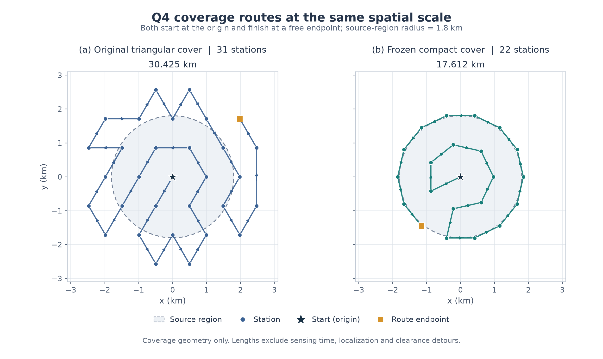

# 第四问第二版：紧凑覆盖及下界对照

2026-09-11。研究分支`research/q4-cover-search`；上一版保留在`research/q4-state-search@7dec922`。本轮策略源码冻结于`eeb69fe`，最终配置为`compact_22 + joint`，见[selection.json](selection.json)。本轮没有运行官方模拟器，没有影响正在进行的采集，也没有修改论文正文。

## 先回答上一版到底多慢

沿用历史`session_lower_bounds.py`，仅从各局成功清除与合法观测计算移动下界，再加必需成功清除与空频道查漏动作费用：

| 上一版官方演练 | 虚拟时间/s | 旧口径本局下界/s | T/LB |
|---|---:|---:|---:|
| A，12/12全清 | 11211.633491 | 1729.108273 | **6.484055** |
| B，14/14全清 | 11603.337692 | 1937.940954 | **5.987457** |

两局的现实程序用时分别31.172秒和25.625秒，不能与表中的虚拟计分时间混为一谈。更早已登记第四问为12253.931642虚拟秒、4.328现实秒，旧下界2221.626249秒，约5.52倍。另核对27份历史已完成采集记录，没有发现虚拟时间远低于一万秒的旧第四问。

这个下界是乐观松弛，不是已经构造出的可执行最短路线；T/LB不能解释为保证可实现的提速倍数。两次演练场景不同，也不能用6.48与旧5.52直接判断哪个算法更差。

## 新版实测结果

从两个已证明覆盖的几何候选和两种调度中，在16个开发场景选择一套配置。冻结后才开启以下独立场景，两种对照与新版使用完全相同的场景和误差场，逐局完整轨迹都保留。

| 独立场景 | 方法 | 全清 | 平均虚拟时间/s | 平均共同下界/s | 均时÷均界 |
|---|---|---:|---:|---:|---:|
| 64例随机确认 | 最早triangular | 64/64 | 12033.316 | 2089.318 | 5.759 |
| 同64例 | 上一版state_pruned | 64/64 | 10602.583 | 2089.318 | 5.075 |
| 同64例 | **新版22点联合调度** | **64/64** | **7183.930** | **2089.318** | **3.438** |
| 28例压力集 | 最早triangular | 28/28 | 12247.887 | 1683.638 | 7.275 |
| 同28例 | 上一版state_pruned | 28/28 | 11103.955 | 1683.638 | 6.595 |
| 同28例 | **新版22点联合调度** | **28/28** | **7740.103** | **1683.638** | **4.597** |

相对上一版，确认集平均节省3418.653秒（32.244%），64胜0负；配对平均节省95%重采样区间`[3249.143,3598.995]`秒。压力集平均节省3363.852秒（30.294%），27胜1负；区间`[2783.225,3955.793]`秒。逐局新旧用时比的95分位分别0.7618、0.9242。

表中最后一列是平均时间除以平均下界。**逐局T/LB再取平均**是另一种统计：确认集新版3.477、上一版5.134；压力集新版8.430、上一版12.963。聚集场景的物理下界很低，因此压力集这两个平均口径差别很大；不能混称“平均倍数”。每一局的T、LB与T/LB都在summary.rows和原始记录中。

本地共同下界仍采用旧公式，但评估器在所有动作退出后使用真值源位置构造共同边权，避免两种方法因观测不同得到不同分母。它比官方仅观测外包圆下界通常略强；两种来源的比值不能跨场景直接当作提速率。策略不读取这些事后真值。详见[实验协议及下界口径](PROTOCOL.md)与`experiments/q4_comparison_bounds.py`。

## 为什么这次改善更明显

上一版主要调整何时清除和何时停止重复测量，却保留了31点三角网。这些点中有不少距离目标圆盘很远，其完整覆盖路线约30.425公里。

本轮使用原点、半径970米的7点内环和半径1851.290354米的14点外环，共22点。固定覆盖路线约17.612公里，缩短42.11%。仍按真实反馈建立候选区；已有near或19.9米外包圆证书的频道可跳过重复扫描；持证清除任务继续插入覆盖路线。未定位源使用原主动探测与有限光学搜索兜底。



确认集节省的3418.653秒中，移动减少2742.981秒、检测减少581.172秒、换频减少107.766秒，光学费用反而增加13.266秒。收益主要来自行走减少，不是代码执行时间缩短。新版离线程序均时约0.092秒，压力集约0.122秒；这些程序时间不含官方HTTP延迟。

覆盖保证不是“在许多采样点没发现漏洞”。对每个源位置x，1000米内的测点集合S必须使x属于conv(S)，这样任意经过源的闭发射半平面至少包含一个可接收测点。程序将整个圆盘外框完整四叉划分，对每个可能含源的格子同时证明支持点距离和凸包包含；未证明格不能算通过，并由另一段代码重放所有叶证据及分区完整性。普通浮点计算使用保守余量，不宣称区间算术的形式化证明。

## 保留的失败与限制

25点候选也有效，有额外的36面三角剖分证明，覆盖路线18.014公里。开发集上25点joint均时7178.430秒、共同下界2034.078秒、3.529倍；22点joint均时7100.848秒、同下界、3.491倍。22点与25点仅平均差77.582秒，8胜8负，区间`[-191.191,375.054]`跨零。因此选择22点是按开发均值作出的配置选择，不能声称它已被证明优于所有25点配置。

仅缩紧覆盖后再统一清除的deferred方案，22点开发均时7296.713秒、3.587倍，同组joint更快；25点deferred为7586.160秒、3.730倍。全部开发路线保留，未删除不利结果。

压力集唯一退化例是边界向外发射场景394204，11源：上一版12487.082674秒、共同下界2809.341716秒、4.444843倍；新版13034.478989秒、同下界、4.639692倍，增加547.396315秒。

该局扫描及换频减少560秒，但合法光学失败从96次增至327次，多花693秒；移动净增414.396315秒。覆盖正测向观测由21次降至13次，主动探测静默由9次增至35次，需要光学兜底的源由1个增至5个。覆盖更紧凑保证“至少发现”，并不保证每个源都有足够多、角度足够好的观测。后续应优先为这些单次正接收、靠近边界的源增加有接收依据的定位动作；不能仅继续减少站数。本轮打开独立结果后未针对该例调参。

确认集新版477次、对照各194次合法失败光学检查；压力集新版1308次、对照各1157次。其全部费用已计入上表，全清不等于从未试探失败。

## 采集库究竟验证了什么

冻结后通过SQLite只读连接生成一致快照，使用当时全部11个完整第四问validation/test案例（8+3），151/151源清除。重算了原采集全部动作费用，并分别核对逐动作微秒账本与客户端连续距离账本。初版审计器把两种舍入口径混用导致约3微秒拒绝，修正审计适配器后重审相同名单，策略和轨迹均未修改。

原采集策略是`triangular+bounded_refinement`，平均12203.092791秒，平均旧观测下界2025.090869秒，均时÷均界6.025948；逐局T/LB均值6.033052。额外细化测量全部保留，不能把它直接当成普通triangular基线。

对新版22点×20频道的4840个候选查询，原日志只有220个精确位置/频道且在原清除前的反馈，支持率4.545%。另外4620个查询不支持。**因此该库不能精确计算新版反事实耗时与提速率**；相关新策略时间和比值明确为null，没有插值补造反馈，也没有用库拟合场景分布。详见[脱敏库审计汇总](dataset-validation-summary.json)。本轮新版尚未做官方演练，避免干扰持续采集。

## 验证、复现与入口

本轮开发128条、确认192条、压力84条，共404条完整本地记录均通过独立审计。审计重新验证覆盖证书、物理费用、真实观测前缀的清除/跳测条件、每局共同下界与T/LB、源码快照、完整配对矩阵和summary重算。策略冻结后全仓库932项回归通过；后续演练入口及相关边界检查51项通过，真实文件冻结预检通过，未连接模拟器。

数据位于`results/q4_cover_search/{pilot-25,pilot-22,confirmation,stress}`，保留source.zip、manifest、freeze、summary、完整gzip动作记录和independent_audit。确认种子394101～394164；压力种子394201～394228。source冻结与本地验证资格见[qualification.json](qualification.json)。原始官方会话和采集快照位于Git忽略目录；公开报告只保留脱敏汇总。

在此worktree根目录复现（输出目录须尚不存在）：

```powershell
$py = '..\cumcm2026-b-interference-localization\.venv-win\Scripts\python.exe'
& $py experiments/run_q4_cover_study.py --stage confirmation --profile compact_22 --schedules joint --selection research/q4_cover_search/selection.json --output results/q4_cover_search/reproduced-confirmation --workers 3
& $py experiments/audit_q4_cover.py --input results/q4_cover_search/reproduced-confirmation --output results/q4_cover_search/reproduced-confirmation/independent_audit.json
```

专用演练入口`experiments/run_q4_cover_practice.py`固定第四问演练，核对冻结选择、资格证据与共享控制器锁；遇到采集器占用则停止。每局完成后自动从合法观测计算旧口径下界并报告T/LB。原旧启动入口仍代表其原策略，不能直接运行旧入口后把结果标为本新版。

仅检查本地源码及资格证据、不连接模拟器：

```powershell
& $py experiments/run_q4_cover_practice.py --preflight-only
```
