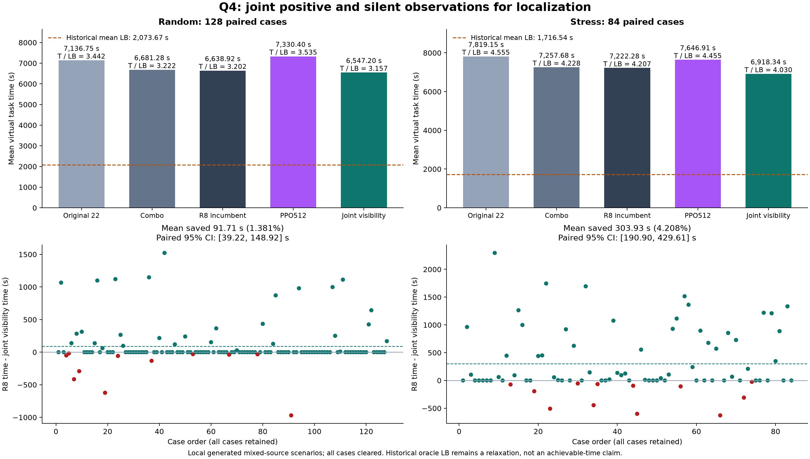

# R9 联合可见性：独立验证通过

冻结方案 `strategies.q4_joint_visibility:run_q4_joint_visibility(config="probe", max_expansions=200)` 达到预登记晋级门槛，作为新的通用状态搜索比较基准。策略/审计/选择器冻结500111ef，开发选择e3c6cda0。此前的核心分支与R8均保留。结果来自本地合成环境；主体统计在官方演练前冻结，后续一局官方核验见RUN_PRACTICE.md。

## 同场景独立结果

每个场景同一完整环境配置、相同历史下界，策略只收到观测接口。开发24随机+14压力用来选择一次，独立128随机+84压力此前未打开；以下全部失败和退步都计入。表中T/LB为均T/均LB，逐局比值另存原始行；不可拿不同集合的均值相减。

### 独立随机128：618101–618228

| 方法 | 均T/秒 | 均LB/秒 | T/LB | P95/秒 | 全清 |
|---|---:|---:|---:|---:|---:|
| 原22点 | 7136.753 | 2073.673 | 3.441601 | 8320.795 | 128/128 |
| combo | 6681.281 | 2073.673 | 3.221955 | 7984.648 | 128/128 |
| 上一最佳R8 | 6638.916 | 2073.673 | 3.201526 | 7932.687 | 128/128 |
| 联合可见性probe（R9） | 6547.203 | 2073.673 | 3.157298 | 7691.675 | 128/128 |
| 固定宏PPO512 | 7330.398 | 2073.673 | 3.534984 | 8582.621 | 128/128 |

相对R8平均节省91.713秒（1.3814%），配对bootstrap95%区间[39.220, 148.917]秒；30胜、11负、87平。P95比例0.969618。

同场景相对固定PPO512平均节省783.196秒（10.684%），95%区间[663.814, 902.345]秒。这是本轮冻结模型的比较，不证明所有强化学习方法都差。

### 独立压力84：618301–618384

| 方法 | 均T/秒 | 均LB/秒 | T/LB | P95/秒 | 全清 |
|---|---:|---:|---:|---:|---:|
| 原22点 | 7819.147 | 1716.543 | 4.555170 | 11394.692 | 84/84 |
| combo | 7257.683 | 1716.543 | 4.228080 | 10729.685 | 84/84 |
| 上一最佳R8 | 7222.276 | 1716.543 | 4.207453 | 10682.793 | 84/84 |
| 联合可见性probe（R9） | 6918.344 | 1716.543 | 4.030392 | 9324.735 | 84/84 |
| 固定宏PPO512 | 7646.910 | 1716.543 | 4.454831 | 11786.506 | 84/84 |

相对R8平均节省303.932秒（4.2083%），配对bootstrap95%区间[190.901, 429.607]秒；43胜、12负、29平。P95比例0.872874。

同场景相对固定PPO512平均节省728.566秒（9.528%），95%区间[515.487, 932.016]秒。这是本轮冻结模型的比较，不证明所有强化学习方法都差。

## 方法及可证明的部分

当前固定22站覆盖、频道调度、正测向形成的canonical可行区域C和R8同点先清除规则继续工作。改变发生在已选中频道的局部定位阶段：把以前的真实正观测P和真实无信号N联合用于辅助外包区域。原先仅把无信号视为探点失利，现在还分析哪些位置、半径与发射朝向的组合已经不可能。

对C包围盒的固定16×16单元B，由正观测得到半径保守下界 r_min(B)=max(1000,max_p min_{s∈B}||p−s||)。若某负观测对整个单元都严格在该半径以内，则不能用“超出接收范围”解释其无信号；全向假设被排除，定向朝向必须同时满足全部正/负半平面条件。对每条约束先向外合并单元内所有可能方位，再求交，只有交集为空才删整格。保留格的外包凸包继续包含尚可能的源。

辅助区只在resolver入口计算一次；之后仅用实际新测向继续裁剪。它用于原五种几何探点的中心/偏移计算，或在最小包围圆半径≤19.9米时进行一次真实持证清除。canonical区域继续负责原覆盖与调度；任何辅助异常仍保留原清除兜底，但模型矛盾会令独立审计和晋级失败。

上述集合排除是条件于题目观测模型的保守逻辑；实现含精确有理数多边形步骤、向外舍入、角度与距离保护，并由另一实现逐前缀复核。角函数并未经过完整机器证明的区间库验证，不能写成形式化验证软件或绝对浮点定理。没有关于新探点必然使每局更快的定理。

同时开发的probe_optical会用辅助区缩小完整光学网格；随机开发两候选完全同分，按预登记“相差不足5秒选简单方案”选择probe。虽前者在开发压力更好，本轮没有为它打开独立验证或据此替换选定配置；后续必须另建新实验。

## 审计、退步与瓶颈

开发38场景×6臂及独立212场景×5臂合计1288条运行记录，全部清除。状态搜索1038条物理/逐频道完整覆盖审计、RL250条独立审计全部通过；联合几何及策略前缀专项审计共288条全部通过，R8插入清除约束也逐前缀复核。RL在隔离解释器中加载冻结源码与checkpoint，仅CPU确定性推理，不训练，模型不接收真值。完整环境仅由外层构造器持有，并在策略终止后计算LB。

逐局退步在qualification.json完整保留：随机11局，最大618191多969.650秒（7932.552→8902.202，LB2162.374，3.668445→4.116864）；压力12局，最大618366多628.128秒（5863.835→6491.963，LB630.960，9.293510→10.289021）。缩小可行集合会改变探点、同点固定测向误差、R8先清除触发机会与最终光学入口；集合更小不代表实际运动必然更少。

独立随机平均省91.713秒，其中移动70.276、光学21.328、普通检测0.117秒；独立压力省303.932秒，其中移动222.539、光学79.000、普通检测2.262秒。其余是换频细小差异，清除成功费用不变。这是实际两条完整轨迹的费用分解，并非固定未来行为的因果消融。详见各阶段paired-cost-analysis.json。

旧LB是利用退出后真值形成的放松下界，没有支付未知目标的全部搜索信息代价；因此T/LB不能直接解释为还能改进同样倍数。置信区间只描述本轮生成器/家族抽样的统计不确定性，不证明官方未知分布也有相同收益。

## 复现与文件

Python基础环境使用已有项目.venv-win；RL使用q3-deep-rl/.venv-win的PyTorch 2.9.1+cpu与NumPy2.2.6。无需GPU。按PROTOCOL.md的冻结spec/selection运行run_q4_round2.py；confirmation使用--stage confirmation --start 618101 --count 128，stress使用--stage stress --start 618301 --count 84。必须输出到新目录，不覆盖本次证据。随后依次运行通用--audit、audit_q4_clear_before_probe_batch.py、audit_q4_joint_visibility_prefix_batch.py；run_q4_frozen_rl_compare.py以同stage完整records构造同场景RL；选择器核对hash、配对与全部审计。

源码与checkpoint的固定SHA、24旧R8重放及旧RL精确重放记录见rl_reference/README.md、reference.json、compatibility-check.json。每stage/source.zip可恢复算法；选择器、分析与图均有脚本。新模拟器入口另受严格演练专用和共享锁检查；本报告的实验不占用模拟器、不读取采集数据库。

晋级只表示本轮可靠改善，优化目标尚未结束。后续优先检验能否在真实新无信号后继续收紧辅助区，以及从已证实可接收区域选择探点；这两条路线还未得到性能结论。

## 后续官方演练核验

13/13全部清除；T=6673.890281秒，历史条件下界=2085.3740759251605秒，T/LB=3.2003324286263504。官方登记和实际观测前缀审计通过，只做演练。此单局不能证明平均增益，也没有同官方case的RL配对；原始材料和去标识观测导出见[演练说明](RUN_PRACTICE.md)。

## 尾部统计的补充限制

冻结晋级后额外做10000次逐局配对bootstrap（seed618959）检查P95不确定性，不改变原门槛：随机P95节省95%区间[30.032,516.261]秒，压力为[-287.375,2055.355]秒。因压力仅84局且极端样本稀少，虽然P95点估计下降12.71%，其区间仍跨零，不能把压力尾部改善称为已单独得到统计证实；压力平均节省的区间则明确为正。复现脚本supplement_q4_joint_tail.py、原结果tail_bootstrap_supplement.json均保留。
