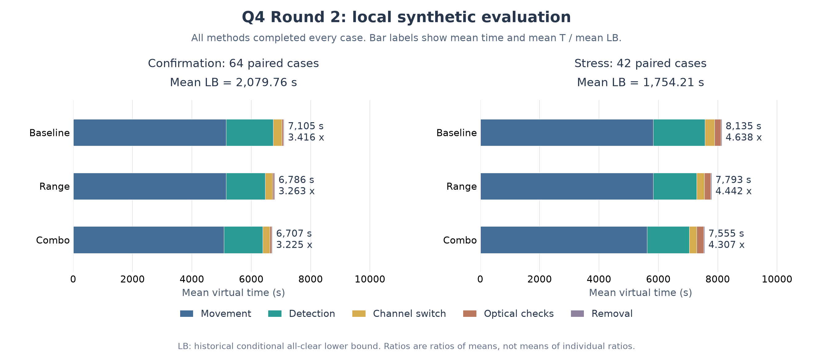

# 第四问持续优化：首轮独立验证

2026-09-11。本轮起点是22点joint版本`1e58ce9`，没有运行官方模拟器或干扰采集，没有写论文正文。所有现有核心分支均登记保护。当前通过验证的首选为`strategies.q4_range_scheduling:run_q4_range_scheduling`，配置`config="onroute", max_expansions=200`；22点几何、原主动定位和光学兜底保留。

## 结果

冻结配置后采用64个新随机场景与42个新压力场景，各策略同场景配对。下表比值为**平均用时除以平均共同下界**，不是逐局比值的平均。

| 集合 | 策略 | 全清 | 平均T/s | 平均LB/s | 均时/均界 |
|---|---|---:|---:|---:|---:|
| 独立随机64局 | 原22点joint | 64/64 | 7104.658 | 2079.761 | 3.416 |
| 同组 | 严格远距删测 | 64/64 | 6785.939 | 2079.761 | 3.263 |
| 同组 | **远距删测+有预算的调度** | **64/64** | **6706.961** | **2079.761** | **3.225** |
| 独立压力42局 | 原22点joint | 42/42 | 8135.385 | 1754.206 | 4.638 |
| 同组 | 严格远距删测 | 42/42 | 7792.933 | 1754.206 | 4.442 |
| 同组 | **远距删测+有预算的调度** | **42/42** | **7554.617** | **1754.206** | **4.307** |

组合对原22点：随机平均节省397.697秒（5.598%），配对95%bootstrap区间[334.745,467.196]秒，64胜0负；压力平均节省580.768秒（7.139%），区间[414.096,802.332]秒，41胜1负。原版与组合的95分位用时分别8272.319→7810.548秒、12193.092→11816.892秒。

顺序检验先确认range相对原版，再确认组合相对range的增量。随机组额外节省78.978秒，区间[28.595,139.778]秒；压力组额外节省238.316秒，区间[76.226,464.758]秒。两步均通过预先指定的全清、随机均值区间和尾部上限门槛。该bootstrap区间是统计近似，不是有限样本形式化保证。



唯一相对原22点退化的独立压力案例为`narrow_strip-610236`：5493.808388→5505.335226秒，多11.526838秒；共同下界636.000004秒，8.638063→8.656187倍。组合相对仅range在随机组有8局退化、压力组有8局退化，最差分别199.799、65.369秒；不能因为组合对原版大多更快，就说新增调度每局都有效。完整损失列表见[qualification.json](qualification.json)。

## 改了什么

1. **严格远距删测。** 源已被真实正观测发现，候选区域为C。若下一站p满足dist(p,C)>1500+1e−5，则任意允许接收半径、任意发射方向均不能接收。仅省略这类已知频道测量，未知频道正常扫；推断不写成实际观测，也不给空频道添加虚构覆盖信用。单独版本随机、压力平均分别改善4.486%、4.209%，所有移动和清除动作仍可对照检查。
2. **16源发现后的调度。** 公开源数上界为16，已经真实发现16个不同频道后，不必继续搜索新源；仍须通过真实清除完成任务，不能把16次发现当成全清。原来还要求16个源都能立即安全清除，才允许省掉剩余覆盖。
3. **有预算的顺路提前服务。** 仅对候选外包圆半径≤40米、经过其中心至下一覆盖点的绕行≤100米的源触发。每源最多一次、整局最多4次、每次最多60虚拟秒。原探点与清除模块继续使用，下一动作超出时间片就返回覆盖。240秒只界定提前服务本身费用，不界定相对原策略的整局退化。

当前range按实际调谐频道重新排序，因此不能直接断言新测量序列必为原序列的子序列、换频次数必不增。审查发现了这个证明缺口；后续shadow调谐顺序配置已在独立实验树中实现但尚未做新场景验证，不属于上表最佳版。组合中的提前服务仍为启发式，不具有逐局最优保证。

## 未采用的路线与研究边界

光学条带候选以半对角线≤19.8米的矩形单元覆盖真实候选多边形，整个区域有几何证书，旧网格始终保留作完整遍历成本对照。它在狭长区域能明显缩短搜遍整个区域的路线，但实际目标未知，首次命中的期望成本并不等于完整遍历成本。24个开发随机场景均时7041.612→7084.819秒，共同下界2011.164秒，比值3.501→3.523，均值退化43.206秒；14个开发压力场景7658.853→7596.682秒，共同下界1831.689秒，比值4.181→4.147，但区间跨零且单局最大退化1014.450秒。该候选未进入独立验证，不能称已被证明处处无效。

其本轮新建分支`experiment/q4-r2-localization`及干净工作树已删除，事先保存并验证了[恢复bundle](archives/optical-rejected.bundle)和[哈希及拒绝原因](archives/optical-rejected.json)。原核心分支未删除，实验源代码与完整记录仍可复核。

用户补充的分层MCTS、POMCPOW/VOMCPOW、ADVT资料有价值，尤其是按未来观测分支评估后续完成成本。当前上层已有DP+A*，主要缺口是没有未来观测分支，不应称作一步贪心。概率模型只适合辅助选动作，不能替代几何完备性；同点固定误差、未知发射朝向和概率先验偏差均需处理。详见[文献核验](LITERATURE.md)。本轮没有实现或验证这些文献算法，不使用它们的名字包装当前方法。

## 复现与状态

开发随机24局、开发压力14局先比较4候选与基线，再在相同开发场景比较组合，重复开发不算新增独立场景；冻结后确认64局、压力42局。总计144个不同场景、622份多方法完整轨迹，全部通过独立物理、真实观测前缀、覆盖几何与下界审计。原932项回归在基线阶段通过；本轮新增及相关针对性检查累计106项通过（94+8+4，不将重复执行再计数）。

所有数据在`results/q4_round2/`。每组保留manifest、source.zip、完整gzip轨迹、summary和independent_audit。下界公式沿用历史口径，但本地配对采用退出后的真值构造共同分母，官方会话通常使用观测外包圆；不跨案例或跨分母来源拼接提速率。本轮数据全部为明确标注的本地合成场景，尚无新版官方演练成绩。

```powershell
$py = '..\cumcm2026-b-interference-localization\.venv-win\Scripts\python.exe'
& $py experiments/run_q4_round2.py --specs research/q4_round2/combination-specs.json --stage confirmation --start 610101 --count 64 --selection research/q4_round2/selection.json --workers 3 --output results/q4_round2/reproduced-confirmation
& $py experiments/run_q4_round2.py --audit --output results/q4_round2/reproduced-confirmation
```

以上复现输出目录须尚不存在。策略源码或审计器变化后冻结检查会拒绝，需使用对应提交复现。`experiments/evaluate_q4_round2.py`应用预定顺序门槛，生成资格与逐局退化清单。

**研究尚未结束。** 目前发现了可信改善，尚不满足连续三轮无可信改善的停止条件。下一步是验证shadow调谐的结构性保证，并评估观测分支规划是否有足够收益支撑更高实现成本。官方演练入口仍需为本轮资格格式单独适配，不能用旧22点入口冒充本轮组合方法；持续采集期间不抢占模拟器。若先碰到约5%的额度保留线，按资源限制报告，不能声称已达最优。
