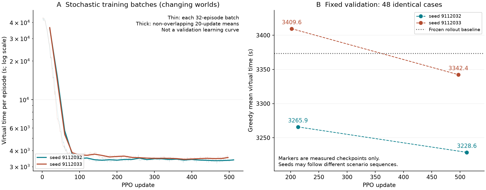
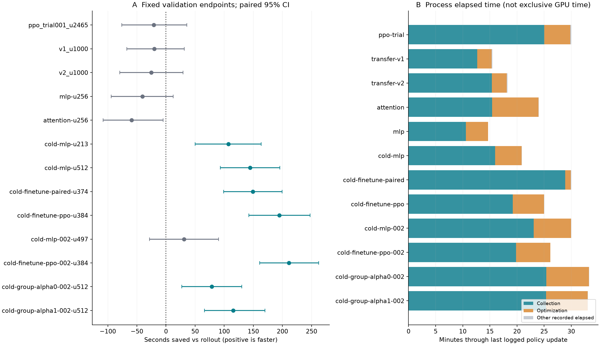
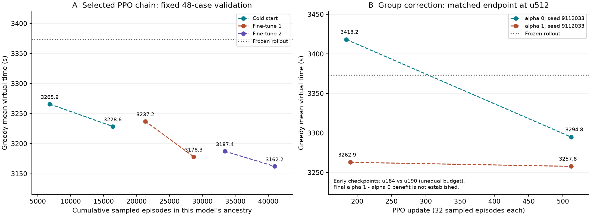

# Q3 RL 训练试验与固定验证记录

这份记录只读取指定归档中的真实日志和已经完成的验证结果，不运行仿真、不加载模型、不写论文正文。训练曲线与固定验证严格分开。全部输入、成员文件和分析脚本的SHA256见 `audit.json`；原始大日志保留在归档中，仓库只保存 `training_curves.json.gz` 中的精简每更新标量。此表覆盖已提供完整训练日志的试验；只有验证产物而缺少训练日志的旧试验只列验证端点，不补造训练成本。

## 训练试验总表

实际BC局数由日志阶段计算，不按config中的默认参数推测。继承检查点的试验不会重新进行BC；下面的策略采样局数只计当前试验参与更新的采样，**不包含继承模型的历史训练成本**。采样可以重复已经训练过的场景，局数不等同于全新世界数量。REINFORCE额外执行同场景greedy baseline，单列该列，不能按与PPO相同局数声称使用了相同仿真预算。

| 试验 | 控制/网络/训练/分布 | 完成/计划更新 | BC局 | 策略采样局 | 额外baseline局 | 末更新时长/min | 终止证据 |
| --- | --- | --- | --- | --- | --- | --- | --- |
| ppo-trial-001 | v1 / mlp / PPO / alpha0 | 2465/4000 | 128 | 78880 | 0 | 29.99 | explicit_deadline_log |
| transfer-v1-001 | v1 / mlp / PPO / alpha0 | 1000/1000 | 0 | 32000 | 0 | 15.44 | requested_updates_reached |
| transfer-v2-001 | v2 / mlp / PPO / alpha0 | 1000/1000 | 0 | 32000 | 0 | 18.24 | requested_updates_reached |
| joint-attention-matched-001 | v3 / attention / PPO / alpha0 | 256/256 | 0 | 8192 | 0 | 24.00 | requested_updates_reached |
| joint-mlp-matched-001 | v3 / mlp / PPO / alpha0 | 256/256 | 0 | 8192 | 0 | 14.68 | requested_updates_reached |
| joint-cold-mlp-001 | v3 / mlp / PPO / alpha0 | 512/512 | 0 | 16384 | 0 | 20.90 | requested_updates_reached |
| cold-finetune-paired-001 | v3 / mlp / REINFORCE / alpha0 | 374/384 | 0 | 11968 | 11968 | 29.99 | explicit_deadline_log |
| cold-finetune-ppo-001 | v3 / mlp / PPO / alpha0 | 384/384 | 0 | 12288 | 0 | 25.01 | requested_updates_reached |
| joint-cold-mlp-002 | v3 / mlp / PPO / alpha0 | 497/512 | 0 | 15904 | 0 | 30.00 | configured_wall_budget_reached_in_log |
| cold-finetune-ppo-002 | v3 / mlp / PPO / alpha0 | 384/384 | 0 | 12288 | 0 | 26.17 | requested_updates_reached |
| joint-cold-group-alpha0-002 | v3 / mlp / PPO / alpha0 | 512/512 | 0 | 16384 | 0 | 33.31 | requested_updates_reached |
| joint-cold-group-alpha1-002 | v3 / mlp / PPO / alpha1 | 512/512 | 0 | 16384 | 0 | 33.07 | requested_updates_reached |

| 试验 | 训练随机种子 | 初始化来源 | 实际策略采样场景段（闭区间） | 源码 | CPU workers | hidden |
| --- | --- | --- | --- | --- | --- | --- |
| ppo-trial-001 | 9112026 | random | [[100129, 179008]] | 3315abf | 4 | 96 |
| transfer-v1-001 | 9112027 | ppo-trial-001/ppo_002465.pt | [[100001, 112001], [180001, 199999]] | acb447d5 | 4 | 96 |
| transfer-v2-001 | 9112027 | ppo-trial-001/ppo_002465.pt | [[100001, 112001], [180001, 199999]] | acb447d5 | 4 | 96 |
| joint-attention-matched-001 | 9112031 | joint-ppo-001/ppo_000344.pt | [[150001, 158192]] | d33074b | 4 | 96 |
| joint-mlp-matched-001 | 9112031 | joint-ppo-001/ppo_000344.pt | [[150001, 158192]] | d33074b | 4 | 96 |
| joint-cold-mlp-001 | 9112032 | random | [[160001, 176384]] | d33074b | 4 | 96 |
| cold-finetune-paired-001 | 9112034 | joint-cold-mlp-001/ppo_000512.pt | [[140001, 151968]] | 20bb10d | 4 | 96 |
| cold-finetune-ppo-001 | 9112034 | joint-cold-mlp-001/ppo_000512.pt | [[140001, 152288]] | 20bb10d | 4 | 96 |
| joint-cold-mlp-002 | 9112033 | random | [[180001, 195904]] | d33074b | 4 | 96 |
| cold-finetune-ppo-002 | 9112035 | cold-finetune-ppo-001/ppo_000384.pt | [[120001, 132288]] | f912dc8 | 4 | 96 |
| joint-cold-group-alpha0-002 | 9112033 | random | [[180001, 196384]] | f912dc8 | 4 | 96 |
| joint-cold-group-alpha1-002 | 9112033 | random | [[180001, 196384]] | f912dc8 | 4 | 96 |

末更新时长来自 `elapsed_wall_s`，包括该训练进程当时的等待和保存等开销，不代表GPU独占时间；并发试验不能直接用它推算GPU工作小时。达到更新数只是已完成预设预算，不代表收敛或达到最优。deadline末尾采样可能没有进入更新，这些任务单列在audit中。早期日志没有optimizer_steps字段，不能补造优化器更新次数。

## 两种曲线不能混用



左图是随机行为策略在不断变化场景上的训练批均值；浅色线为每批32局，深色线为20个更新的不重叠均值。右图才是同一48个场景（6000—6047）上的greedy验证；虚线仅连接已经测过的检查点，不表示中间所有权重都被评估。不同随机种子对应不同初始权重、采样随机性，并可能对应不同训练场景序列，所以没有把它们平均成一条平滑的“算法性能曲线”。



误差条是同48场景相对冻结rollout的配对均值差，bootstrap 10000次、随机种子913、百分位95%区间；它衡量场景样本波动，**不是不同训练随机种子的不确定性**。因为这些验证结果用于反复开发、选择检查点，不能把该区间当成独立最终测试的保证。



左图将cold001及两次PPO微调按真实继承关系连接到累计采样量，终点共40960局（16384+12288+12288），没有BC。图中只列测过的固定验证端点，所用场景段、初始化和学习率见表；这是开发中选出的模型链，不是预先保证单调改善的算法曲线。右图单独保留同种子、同训练场景序列、同512×32采样量的alpha0/1对照；两个早期检查点分别是u184/u190，不能将它们当作同训练量对照。

## 全部已归档RL验证端点

| 检查点 | 平均虚拟秒 | 比rollout节省秒 [95% CI] | 胜/负/平 | 全清成功 | 失败清除 |
| --- | --- | --- | --- | --- | --- |
| paired-v2-001-u340 | 3369.278 | 3.97 [-50.51, 62.67] | 25/23/0 | 48/48 | 0 |
| rl_bc_trial001 | 3471.007 | -97.75 [-152.07, -44.36] | 15/32/1 | 48/48 | 0 |
| ppo_trial001_u2052 | 3371.231 | 2.02 [-48.88, 54.37] | 24/24/0 | 48/48 | 0 |
| ppo_trial001_u2465 | 3394.076 | -20.82 [-76.06, 35.73] | 22/26/0 | 48/48 | 0 |
| rl_ppo_trial001_u405 | 3376.375 | -3.12 [-48.63, 42.75] | 24/24/0 | 48/48 | 0 |
| rl_random_trial001 | 7492.055 | -4118.80 [-4374.30, -3878.25] | 0/48/0 | 48/48 | 0 |
| ppo_transfer_v1_001_u1000 | 3393.167 | -19.91 [-67.53, 31.24] | 17/31/0 | 48/48 | 0 |
| ppo_transfer_v2_001_u1000 | 3398.647 | -25.39 [-79.40, 29.07] | 26/21/1 | 48/48 | 0 |
| joint-bc-001 | 3497.941 | -124.69 [-177.77, -73.33] | 10/38/0 | 48/48 | 0 |
| joint-ppo-001-u178 | 3446.535 | -73.28 [-128.51, -14.69] | 17/30/1 | 48/48 | 0 |
| joint-attention-matched-001-u256 | 3432.241 | -58.99 [-108.10, -4.89] | 17/31/0 | 48/48 | 0 |
| joint-cold-mlp-001-random | 45861.941 | -42488.69 [-43169.08, -41795.90] | 0/48/0 | 48/48 | 0 |
| joint-cold-mlp-001-u213 | 3265.859 | 107.39 [49.96, 163.53] | 36/12/0 | 48/48 | 0 |
| joint-mlp-matched-001-u256 | 3413.818 | -40.57 [-94.38, 12.45] | 24/24/0 | 48/48 | 0 |
| joint-cold-mlp-001-u512 | 3228.646 | 144.61 [93.25, 195.65] | 39/9/0 | 48/48 | 0 |
| cold-finetune-paired-001-reinforce_000115 | 3231.476 | 141.78 [88.67, 196.57] | 38/10/0 | 48/48 | 0 |
| cold-finetune-paired-001-reinforce_000374 | 3224.109 | 149.14 [98.79, 199.47] | 39/9/0 | 48/48 | 0 |
| cold-finetune-ppo-001-ppo_000155 | 3237.178 | 136.08 [89.46, 182.20] | 36/12/0 | 48/48 | 0 |
| cold-finetune-ppo-001-ppo_000384 | 3178.339 | 194.91 [142.09, 247.63] | 43/5/0 | 48/48 | 0 |
| joint-cold-mlp-002-ppo_000202 | 3409.558 | -36.31 [-97.03, 24.86] | 22/26/0 | 48/48 | 0 |
| joint-cold-mlp-002-ppo_000497 | 3342.352 | 30.90 [-28.23, 90.20] | 26/22/0 | 48/48 | 0 |
| cold-finetune-ppo-002-ppo_000148 | 3187.419 | 185.83 [129.68, 242.08] | 41/7/0 | 48/48 | 0 |
| cold-finetune-ppo-002-ppo_000384 | 3162.245 | 211.01 [160.94, 262.22] | 41/7/0 | 48/48 | 0 |
| joint-cold-group-alpha0-002-ppo_000184 | 3418.220 | -44.97 [-105.81, 16.91] | 19/29/0 | 48/48 | 0 |
| joint-cold-group-alpha0-002-ppo_000512 | 3294.830 | 78.42 [27.24, 130.13] | 29/19/0 | 48/48 | 0 |
| joint-cold-group-alpha1-002-ppo_000190 | 3262.890 | 110.36 [46.16, 175.78] | 34/14/0 | 48/48 | 0 |
| joint-cold-group-alpha1-002-ppo_000512 | 3257.778 | 115.47 [65.91, 170.01] | 39/9/0 | 48/48 | 0 |

## 当前证据的边界

1. 冷启动001（训练种子9112032）的u213/u512固定验证为3265.859/3228.646秒；第二种子9112033的u202/u497为3409.558/3342.352秒，后者末端对rollout的配对区间仍跨0。不能把第一条好曲线当作所有种子的保证，也不能将更新数不同的两个端点当成严格等预算的随机种子效应估计。
2. 冷启动与BC热启动试验的初始化、训练场景、训练局数及继承成本不同。因此当前跨试验结果不能单独证明“BC导致坏局”或“从零训练必然更好”。BC阶段teacher交叉熵与PPO阶段同名诊断的含义也不同；aux_bc_coef=0时PPO不按该交叉熵学习。
3. v1/v2同起点同更新数的特征对照，以及MLP/attention同起点同更新数的网络对照，比普通跨试验比较更有解释力。但各只有一组训练随机种子，仍不能证明额外几何特征或注意力在所有预算、初始化下无用。
4. 训练总虚拟时间下降可以来自减少远距离来回扫描，不能仅凭全动作熵或teacher交叉熵判断源内探测是否充分探索。历史快照没有每源条件熵日志，新的分组概率版本才记录它；没有对旧日志虚构这种指标。
5. 全清成功来自当前合法动作和保守兜底系统整体。现有记录不支持把全部成功率、全部时间收益归功于神经网络，更没有达到理论下界或不可再优化的证明。未使用官方正式测试，也未查看封存最终测试种子。
6. 从cold001/u512出发，后续PPO384端点3178.339秒，paired REINFORCE374端点3224.109秒。但后者多运行11968条baseline轨迹，且时间截止使两者未完成相同更新数；这组结果不能被写成“在完全相同算力/仿真预算下PPO优于REINFORCE”。
7. 05:10新增的第二次PPO微调u384为3162.245秒，比冻结rollout均值3373.253秒节省211.008秒（6.255%）；同48局41胜7负、全部清除、零失败清除，最坏局仍慢199.794秒。这条继承链累计40960条参与更新的策略轨迹，不能只报告最后一轮12288局。相对上一轮再快16.094秒，不据此断言该增量已经显著。
8. alpha0/alpha1同预算u512分别3294.830/3257.778秒；alpha1相对alpha0节省37.052秒，原归档配对95%区间[-12.447,86.859]秒、24胜24负，额外收益尚未确立。这一区间来自归档比较文件，表中各策略对rollout的区间由本脚本独立bootstrap；两者对象和随机种子不同，不能混写。axis新候选尚在独立试验中，没有将它的未完成结果加入此表。

## 复现

```powershell
..\cumcm2026-b-interference-localization\.venv-win\Scripts\python.exe research/summarize_rl_training.py --artifacts ../q3-v1-artifacts --output research/rl_training_audit
```

脚本仅需numpy和matplotlib，不需要Torch。`--archives`可显式指定新的完整归档名；不会自动扫描新增最终测试文件。图和表由同一次归档解析生成，精简日志每个更新都有记录，没有只保留表现好的训练批。
