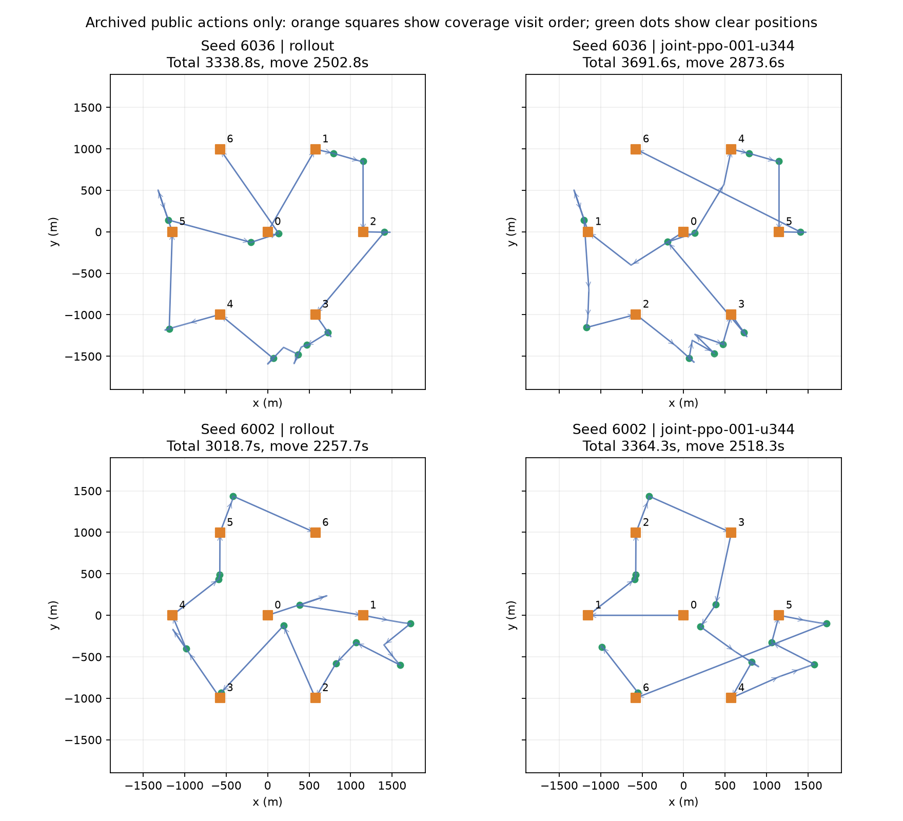

# RL 验证轨迹诊断：瓶颈在决策行为，不在重复执行

本记录只分析已完成的 48 个验证场景 `6000..6047`。读取 `baseline-validation`、`milestone-0200`、`milestone-0230` 共 19 组、912 局存档，没有启动模拟器、重新评估 checkpoint、使用隐藏源坐标参与诊断或接触最终测试。所有轨迹逐条重算移动、切换、检测、光学和清除成本，与存档统计一致；源候选通过此前的公开正负观测重建，所有非兜底 RL 探测坐标均匹配合法候选。

## 1. 时间差主要来自路线，单纯减少接口调用解决不了

单位为虚拟秒；这些版本均为 48 局完整清除，失败清除为零。

| 策略 | 总时间 | 移动 | 检测 | 换频 |
|---|---:|---:|---:|---:|
| 旧 rollout | 3373.25 | 2553.38 | 644.38 | 111.85 |
| v3 BC | 3497.94 | 2663.63 | 658.44 | 112.23 |
| v3 PPO u344 | 3419.82 | 2594.13 | 648.33 | 113.71 |
| v3 PPO u522 | 3444.22 | 2612.60 | 653.12 | 114.85 |
| paired v2 u994 | 3355.03 | 2522.31 | 653.54 | 115.54 |
| 状态搜索长轴分位候选 | 3114.00 | 2347.36 | 593.23 | 109.77 |

v3 u344 比 rollout 慢 **46.57 秒**，其中移动多 **40.76 秒，占 87.5%**，检测多 3.96 秒，换频多 1.85 秒。paired u994 移动省 31.07 秒，却多花检测 9.17 秒、换频 3.69 秒，最终只省 18.22 秒。两者相对 rollout 的配对 95% bootstrap 区间都跨零：本脚本按“当前方法减 rollout”、10000 次重抽样/RNG 913 得到 u344 `[-6.71,95.10]`、paired u994 `[-74.90,33.77]`。它们尚不能支持稳定优于 rollout 的结论，也不能把某个点估计最好的 checkpoint 当作独立测试结论。

这些方法都没有对完全相同的坐标/频道重复测量，没有测量已清除频道，RL 兜底时间为零。u344 每局主动无信号测量仅 0.27 次，检测本身至多约 1.35 秒量级，删掉这类动作不足以解释主要差距。已发现源在覆盖点被再次测量约 20.69 次/局，rollout 为 20.15；这些测量可能带来有效交会信息，不能把“已发现”直接当作“冗余”。

## 2. 动作空间扩大了，但部署行为仍接近教师模式

| checkpoint | 主动探测总数 | 中心探测 | 当前位置探测 | 横向/半程探测 | 原点连续扫满20频道 | 有扫描中断的局数 |
|---|---:|---:|---:|---:|---:|---:|
| v3 BC | 1365 | 1362（99.78%） | 3 | 0 | 48/48 | 0/48 |
| v3 PPO u178 | 1246 | 1240（99.52%） | 6 | 0 | 48/48 | 0/48 |
| v3 PPO u344 | 1257 | 1244（98.97%） | 13 | 0 | 48/48 | 0/48 |
| v3 PPO u522 | 1320 | 1317（99.77%） | 3 | 0 | 48/48 | 2/48（共4次） |
| paired v2 u994 | 1177 | 1171（99.49%） | 6 | 0 | 固定动作 | 不适用 |

第一版 v1/v2 与几何特征升级版本也有 99% 左右的中心占比。故目前主要学习成果是**何时访问某个源/覆盖点、以何种顺序清除**，还没有明显转化为新的定位测点规律；v3 新开放的原点部分扫描和站点中断也几乎没有被使用。更多几何输入、更多 PPO 更新或更换 paired baseline，都没有自动消除这种现象。

以上统计来自 **greedy 验证动作**。它不能证明 PPO 采样期间没有探索其他候选，也不能单凭相关性证明“BC 导致失败”。目前缺少训练时按源分组的条件概率、条件熵和梯度贡献记录。BC 起点偏置、平坦 softmax 的候选数量偏置、其他候选实际收益不足，仍是需要区分的机制。主任务已安排无 BC 冷启动和 MLP/attention 同起点实验；本报告不预判它们结果。

## 3. 两个典型坏局



橙色方块标明覆盖点访问顺序，绿色点是实际成功清除位置，不是隐藏源坐标。

**场景6036：u344 比 rollout 慢352.79秒，移动反而多370.79秒。** rollout 先向东北、东、东南顺时针推进。u344 先西行、再扫西南和东南，随后返回中部处理9/16频道，向东北处理1/8频道，回到东点处理2频道，最后还欠西北覆盖点。末次清除位于 `(1408.1,-2.0)`，结束确认需要再去 `(-575.0,995.9)`，该最后长段移动约444秒，含扫描后的尾段总计498.01秒；rollout 的确认尾段为301.23秒。主要问题是把覆盖点留到了不合适的末端，而不是清除指令执行慢。

**场景6002：u344 比 rollout 慢345.59秒，但它的确认尾段恰好为零。** u344 顺序为西→西北→东北→东南→东→西南。处理东侧19频道后，位于 `(1722.3,-98.4)`，先原地测4/20频道，均无信号；随后横跨到最后的西南覆盖点 `(-575.0,-995.9)`，仅这一次移动约492秒。rollout 将东西两侧任务纳入较连续的环行顺序，总移动为2257.67秒，u344为2518.26秒；u344检测还多70秒。可见“最后一次清除后的时间”不能直接当作全部可优化空间，尾段为零也可能有严重的前期折返。

也保留好局6003：u344比 rollout 快605.82秒，证明学习调度确实能在某些观测布局中产生较大改善。坏局和好局同时存在，符合“调度已学到一些东西，但跨场景稳定性不足”的判断。

另作一个严格限定的事后检查：保持所有后续观测点和频道内行动顺序不变，只交换相邻两个已经完成的独立源任务块。u344有24/48局能缩短记录中的路线，平均取每局最佳单次交换可省18.33秒；rollout为13/48局、4.81秒。**这是固定后续坐标的事后路线诊断**，不是在线可实现的保证，因为策略在交换时未必已经知道后续测点。它说明至少部分代价来自清除顺序，不能当作新算法得分或可达下界。

## 4. 下一步只保留两个可测方向

1. **候选组概率校正。** 保留原动作和特征，把覆盖点内的频道视作一组，把同一源的定位/清除候选视作一组。平坦 softmax 的组概率为组内 `exp(logit)` 之和，候选较多的组自带数量优势。最小消融可用 `logit_i - alpha*log(group_size)`，分别比较 `alpha=0` 与 `alpha=1`；后者等价于按组内平均分数分配组概率，再在组内选择动作。它不调用状态搜索，不增加物理动作，也不保证效果更好。若校正改变初始化概率，必须保存并评估 `initialized.pt`，不能把初始化变化混入后续 RL 增益。
2. **源内条件熵诊断及单独消融。** 先记录每个有多个定位选项的源的条件熵、中心点条件概率，以及这些量在训练采样中的分布。现有全动作熵可以主要来自扫描点/频道选择，不能替代这个指标。只有当记录支持“源内分布过早变尖”时，单独加入按源平均的条件熵项；保持候选、网络、PPO预算不变，比较中心占比、测量数、完整清除率和验证总时间。这个实验应与概率校正分开，避免同时改变多个因素。

两个方向都是待检验假设；不能因注意力更大、熵更高或动作更分散就认定方法更好。最终仍以独立验证下的完整清除、配对时间差和稳定性衡量。

## 复现与文件

```powershell
$env:PYTHONPATH='src'
python research/diagnose_rl_validation.py --artifacts ../q3-v1-artifacts --output results/rl/validation_diagnostic.json --evidence-dir research/rl_validation_diagnostic
```

- `summary.json`：19组汇总、配对差值区间、输入存档哈希及事后交换统计。
- `examples.json`：6036、6002与6003四种方法的公开完整行动和候选几何重建。
- `route_comparison.png/.svg`：可直接查看、导出的路线对照。
- 大型完整重建留在忽略的 `results/rl/validation_diagnostic.json`，没有把所有重复存档加入 Git。
