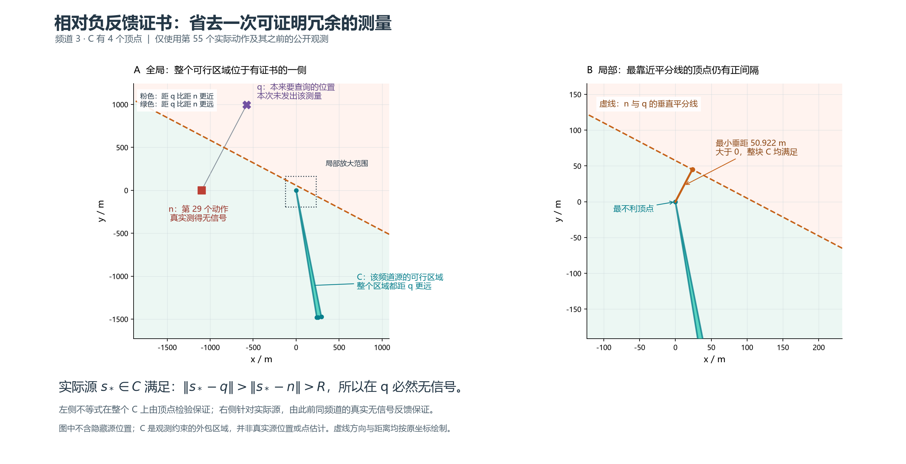

# 冗余测量证书：最终独立验证与可用版本

## 结论与版本

候选 `research/q3-r2-derived-silence`，冻结提交 `760af8230a8e5bda6050663b19d871a9701c9829`，通过完整独立确认、最终随机集和结构压力集。推荐保留为可供下一次官方演练确认的候选；受保护的官方已有基准分支不改。

主配置：`experiments/state_search_candidate_derived_silence_combined_v1.json`。入口：`strategies.derived_silence_state_search:run_derived_silence_state_search`。源码在同名独立工作树 `q3-r2-derived-silence`，无需切换或覆盖用户原工作树。

主要结果是约 **0.475% 的整局虚拟时间改善**，不是数量级提升，也不是接近在线最优的证明。相比增加有限两层搜索，这个局部几何证书的收益证据更充分；不能据此否定完整POMCPOW或强化学习方法族。

## 做了什么

基于原状态搜索v1，仅省去两类可证明冗余的查询：同频道此前实际无信号点结合当前保守候选域，证明新点更远、因而也必然无信号；一次扫描中实际发现第16个源后，不再测尚未出现的频道。新点不是实际测量，不记入真实覆盖；清除与终止仍必须由真实历史证明。完整数学和工程合同见 `DERIVED_SILENCE_PROTOCOL.md`。

生产实现逐操作向外舍入，独立审核用精确有理数重验相对距离条件。审核还删除新增相对推断，要求旧审核器仍能证明实际清除与终止。没有案例编号、种子答案、隐藏真值决策或验证数据分布拟合。

下图只使用一个既有案例当时的公开观测前缀，不画隐藏源位置；可复现脚本与哈希记录随图保存。



## 各阶段分开报告

下表是组合对相同案例基准的配对差。每组均全部清除、零失败清除、接受退出；所有物理、源码冻结与公共前缀证书审核通过。

| 阶段 | 独立案例数 | 基准均T/秒 | 组合均T/秒 | 平均节省95%区间/秒 | 胜/平/负 | 逐局均T/LB：基准→组合 |
| --- | ---: | ---: | ---: | --- | --- | --- |
| 开发 | 16 | 3168.009223 | 3155.884223 | 6.437500～18.687500 | 11/5/0 | 1.744681→1.737997 |
| 独立确认 | 64 | 3094.086850 | 3080.102475 | 10.625000～17.719141 | 48/16/0 | 1.769109→1.761076 |
| 最终随机 | 256 | 3122.258053 | 3107.429928 | 13.027148～16.695313 | 190/66/0 | 1.799833→1.791423 |
| 结构压力 | 28 | 2993.294932 | 2986.223503 | 3.642857～10.964286 | 13/15/0 | 3.516460→3.512402 |

共364个不同本地场景，四组共1456局；不能把1456当成1456个独立案例，也不把压力集与随机集混成一个总体。最终随机集平均旧LB为1750.182585秒，总T/总LB为1.783961→1.775489；压力集平均LB为1391.791511秒，总量比为2.150678→2.145597。平均逐局比和总量比分别给出，二者不同。

压力集区间仅描述对这28个固定结构配置的重采样，不作为官方环境或一般场景总体的统计保证。

最终随机集P95从3514.004806降至3505.569605秒，最大值3794.768013→3769.768013秒。压力集P95保持4404.841289秒，最大值4587.549542→4568.549542秒。最终随机集平均CPU两组同为约1.002075秒，平均墙钟1.014207→1.013418秒；这是本机并发进程的诊断，微小差异不作计算加速结论。

## 最终消融与实际费用来源

| 最终随机集方法 | 平均T/秒 | 平均节省/秒 | 逐局均T/LB | 胜/平/负 |
| --- | ---: | ---: | ---: | --- |
| 原v1 | 3122.258053 | — | 1.799833 | — |
| 仅相对证书 | 3109.152584 | 13.105469 | 1.792328 | 183/73/0 |
| 仅数量上限 | 3120.535396 | 1.722656 | 1.798928 | 30/226/0 |
| 组合 | 3107.429928 | 14.828125 | 1.791423 | 190/66/0 |

组合在最终256局共省631次查询，实际节省3796秒：检测3155秒、换频641秒。移动、光学检查和移除费用逐局保持一致。换频必须逐步计费，不能将省略次数统一乘6秒。

最终集252/256局是基准动作序列仅删除有当时前缀证书的负查询；另外4局还出现一次站内频道重排。原因是省掉扫描尾查询改变了实际调谐频道，下一站使用原有“当前频道优先”顺序。独立复核确认各站保留反馈、非扫描动作和物理路径相同，删测证书全部存在，不构成安全漏洞；原诊断的“不是纯删除子序列”分类保留，见 `diagnoses/DERIVED_FINAL_EXCEPTIONS.md`。

这不证明所有未来情形必不退步。本地所用规则和误差场、反馈序列以及算法调度相互影响；官方交互中的轨迹与收益仍须现场验证。

## 压力集揭示的限制

七类压力结构各四个配置，均安全完成，但最差比值并没有解决。窄带12源案例218026四组均为2969.604045秒，旧LB=256.0000038秒，T/LB=11.600016，本机制没有触发。旧图下界允许相邻清除圆盘边费用为零，且忽略发现成本；该局首次发现已花1750秒。详细费用分解见 `diagnoses/DERIVED_STRESS_REVIEW.md`。

所以结果支持“小幅、可解释、经过独立复核的改善”，不支持“普遍逼近理论极限”。旧LB仍是先知物理松弛，不能据T/LB直接推断相对可达在线最优策略的近似比。也不能用本批比值与另一个官方单局的1.7或1.9直接判断版本优劣，应看同局配对。

## 复核和复现

在 `q3-round2` 中可直接重新审核已归档的完整结果，不启动仿真（输出需使用尚不存在的新路径）：

```powershell
..\cumcm2026-b-interference-localization\.venv-win\Scripts\python.exe experiments/round2_posthoc_audit.py --batches results/round2/derived_silence/final results/round2/derived_silence/stress --output research/round2/derived_reaudit.json --report research/round2/derived_reaudit.md
```

如需实际复跑，在同一工作树先用 `round2_runner.py prepare --trial derived_silence --stage final --spec experiments/state_search_candidate_derived_silence_combined_v1.json --output <全新目录>` 冻结，再 `round2_runner.py run --output <同目录> --workers 3`。候选源码与配置必须仍与原门控匹配；历史目录及记录不得覆盖。源码zip、完整spec和逐文件哈希足以恢复原版本，原提交已推送GitHub。

完整记录位于 `results/round2/derived_silence/{pilot,confirmation,final,stress}`。各阶段旧LB与证书审核为 `research/round2/derived_silence_*_audit.json/.md`。最终逐动作诊断原文约56MB，已无损存为 `diagnoses/derived_silence_final_execution.json.gz`（约2.95MB）；解压哈希和归档哈希见相邻 `derived_silence_final_execution_archive.json`，原JSON无需进入Git。其余逐步诊断和测试凭据亦在该分支保存。

## 官方状态及本轮取舍

演练入口dry-run成功加载新配置，发送请求数为零。这只说明入口可加载，不是官方效果测试。用户的官方采集未被本任务争用；验证SQLite未用于训练或拟合，也未被伪装成新路线的交互反馈。本轮没有正式测试。下一次空闲的官方问题3演练窗口仍需做真实兼容性确认。

与已验证“持证清除尾段”组合在工程上可做，但后者平均仅省约0.045秒，尚无组合实测；保留其独立分支及组合设计，不直接把两份平均收益相加。另一个独立“主频道当前位置候选”已完成16对pilot但未通过扩样门槛，见状态搜索交接报告；本次按用户要求暂停新增研究，删测候选保持上述冻结版本。
