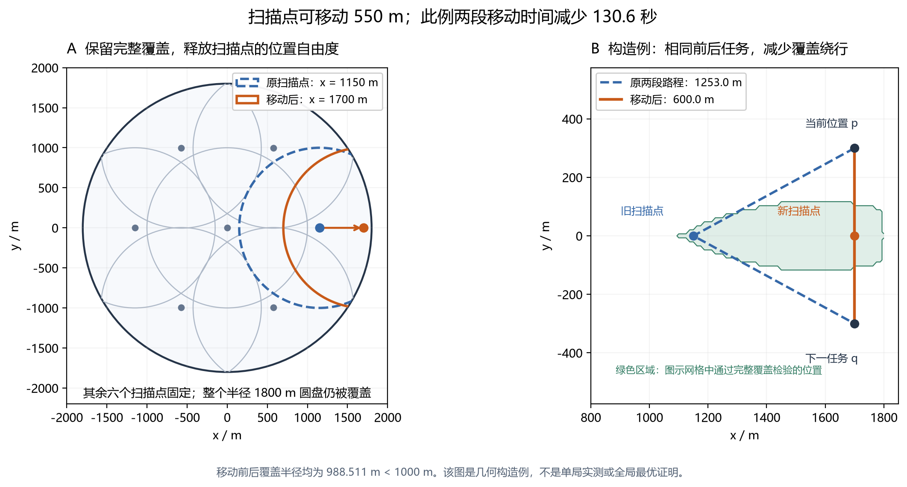

# 第三问状态搜索：算法依据与保证范围

研究交付说明，非论文正文。对应分支 `research/q3-state-search`：基础实现及 axis/inferred 已冻结；未来覆盖移站对应 `8aa6206`，即时移站消融对应 `bdd7a50`。本文解释实际算法，不依据尚未打开的最终测试判断优劣。完整配置必须随实验保存，不能用函数默认参数代替候选 spec。

## 1. 从合法观测到保守区域

在线输入仅有机器人位置、当前频道、时间账，以及 `measure` 返回的 `direction / near / no_signal`、`clear` 返回的结果。源坐标、实际源数、接收半径、场景种子均不传入策略。`ClientState.sources` 保存的是每频道历史反馈，不含真值。见 [观测状态](../../src/simulator_client/state.py#L36)、[实际动作及反馈登记](../../src/strategies/search.py#L102)。

对已知全向源频道 c，维护凸外包区域 C_c。正方位观测在位置 p 给出角度带及 `|x−p|≤1500`；初始区域是半径 1800 m 的场地。圆约束使用 128 边**外切**多边形，方位半宽取 `1.005°`，包含代码采用的测角与小数表示余量。见 [CandidateRegion.observe](../../src/localization/__init__.py#L73)。

同一未清除源的 R 固定。若在 p 收到信号、在 n 无信号，则

\[
\|x-p\|\le R<\|x-n\|
\ \Longrightarrow\ (n-p)\cdot x<\frac{\|n\|^2-\|p\|^2}{2}.
\]

取闭半平面仍是安全外包。每次正、负观测都与此前所有相反类型的位置配对，与到达顺序无关。负观测尚无正观测时只储存；该凸区域实现没有直接减去非凸的 1000 m 圆，也不会误删 1500 m 圆。[OmniCandidateRegion](../../src/localization/omni.py#L16) 专用于第三问，不能照搬至存在背向静默的第四问。

**清除证书。** 若 C_c 的包围圆为 B(z,r)、r≤19.9，则任意 q 满足 `|q−z|≤19.9−r` 都有 `max_{x∈C_c}|q−x|≤19.9<20`。代码在该安全圆内取靠近当前位置的点；不是必须走到圆心。[EfficientSearch._clear](../../src/strategies/efficient.py#L81)。`near` 则直接提供原测点距源不超过 5 m 的依据。每次只有真实 `clear_result=success` 才更新 `cleared`；预测区域或失败清除都不能替代成功回包。

主动定位每次最多 6 个测点；仍未收缩到安全尺度时保留原光学覆盖网格兜底。兜底是有限区域的逐点搜索，单次尝试不具有“必定清除”证书。[实际定位与兜底](../../src/strategies/search.py#L179)。上述几何保证以题目静止、全向、固定 R、误差范围等假设成立为前提；空区域或异常反馈需作为不一致/失败处理。

## 2. 冻结任务的位掩码搜索

每完成一次源处理或完整覆盖扫描，重新构造至多 22 个任务：未执行覆盖站，以及 `detected−cleared−blocked` 中已有代表点的源。源代表点为近源位置或 C_c 包围圆心；它不是已知真坐标。源实际解析过程中继续处理该源，完成后才重新调度，不在每个测量中间任意抢占。[StateSearch._next_task](../../src/strategies/state_search.py#L293)、[执行循环](../../src/strategies/efficient.py#L175)。

冻结这一次的点位与服务费后，状态为 `(M,j)`：M 是已完成任务位掩码，j 是末任务；初始 j=−1 代表当前真实位置。转移到未完成任务 i 的代理费用为

\[
\Delta(M,j,i)=d_{ji}/5+s_i+
\mathbf1_{i\in\mathcal C}\,q\,|\mathcal S\setminus M|.
\]

`RouteTask.service_s` 对源取 5 s，对覆盖站取 `6×background`，其中 `background=max(0,20−cleared_count−source_task_count)`；这只是冻结服务费。当前 axis/inferred spec 取 `scan_source_s=q=0`，并不等于真实扫描免费：实际 5 s 测量及 1 s 换频由动作账完整计费。最初 q=6 的模型消融仍保留，但不属于当前参照配置。

**支配证明。** 对同一个 `(M,j)`，剩余点、服务费、未完成源数完全一样；两个路径前缀具有相同的后续费用函数。因此仅保留较小的 `g(M,j)` 不损失该冻结模型最优解。这是集合加末端的动态规划思想在本有限任务图上的具体应用；不是将不同真实观测历史只凭掩码合并。[Held–Karp 原文出版记录](https://doi.org/10.1137/0110015)。

**剩余下界。** 对 U=未完成任务，下式 d 与 MST 长度均以米计，h 以秒计：

\[
h(M,j)=\min_{i\in U}d_{ji}/5+\operatorname{MST}(U)/5+\sum_{i\in U}s_i.
\]

任意剩余路线先进入 U，再以一条连通路径访问 U，后者长度至少为 MST；省略非负顺序罚项只会降低估值。U 为空取 0。该论证对冻结非负对称旅行矩阵同样成立，不要求三角不等式；矩阵若直接以秒计，则不再除以 5。代码允许改进同一状态后重新入队，不依赖未经验证的启发式一致性。

实现以可行最近邻/2-opt 路线为 incumbent，按 `g+h` 扩展，配合状态支配与上界剪枝；思想来源为 [Hart–Nilsson–Raphael 的启发式图搜索原论文](https://ai.stanford.edu/~nilsson/OnlinePubs-Nils/PublishedPapers/astar.pdf)。预算耗尽仍返回完整可行顺序与数值界，搜索闭合则标记 `exact`。对应 [solve_state_route](../../src/planning/state_route.py#L45)：`cost_s` 为 incumbent U，`lower_bound_s` 为保留前沿下界与 U 的较小者，`model_gap_s=U−L`；过期队列项可能让 L 偏松。`planning_log` 同时记录 `expanded / generated / dominance_pruned / bound_pruned / runtime_s`。

**范围必须保留：** 这些 U、L 只约束本次冻结任务的代理目标；未来新源、未来反馈、实际清除点和定位绕路不在模型内。它们不是原 Q3 最短完成时间的上下界。

## 3. axis 主动选点与逻辑删测

axis 保留原九点：区域中心，以及当前位置至中心半程/全程的横向 ±50、±150 m 点；再用区域最远顶点对确定长轴，在投影区间 1/4、3/8、5/8、3/4 位置加横向候选，总数至多 23。尺度为 `min(200,max(20,width/8))`。所有候选需满足对 C_c 每个顶点距离≤1000，故对凸区域内全部点保证接收；已测的六位小数位置去重。[候选构造](../../src/planning/probe_candidates.py#L20)。

每个候选 a 用至多 5 个等权名义源点评分：包围圆心及最多四个抽取顶点向圆心内缩四分之一的位置。它们只是外包区内假设，**不是官方后验粒子**。在区域副本上安装无误差名义方位，得到残余圆半径 r_k(a)。除 d(a,x_k)≤5 的 near 假设不加后续罚项外，评分为

\[
J(a)=\frac{\|p-a\|}{5}+\frac1H\sum_{k=1}^H
\left[\frac{\|a-x_k\|}{5}+6\mathbf1_{r_k(a)>19.9}
+\lambda\frac{(r_k(a)-19.9)_+}{5}\right],\quad\lambda=0.5.
\]

候选共有的当前测量费用不影响这个排序；公式中的额外 6 s 是经验后续测量罚项，不能解释为已证明的期望剩余时间。去掉非负半径/测量罚项得到评分下界；分项累计时也用未计算项的非负下界，超过 incumbent 才剪枝。因此加速保持这个有限评分的选择，扩大动作集只保证最小代理分值不升，**不保证真实整局耗时下降**。[评分及剪枝](../../src/planning/radius_probe.py#L14)、[axis 调用](../../src/strategies/refined_state_search.py#L15)。所有假设只进入 `region.copy()`，实际观测才能更新在线状态。

清除后共享测量仍是启发式：对其它已知源，要求当前点保证接收、尚未测过、区域半径至少 60 m，名义反馈预计半径减半且减少至少 30 m 才真实测量。[共享规则](../../src/strategies/state_search.py#L134)。

inferred 删测则有不同依据：已知源满足 `d(a,C_c)>1500+10⁻⁵ m` 时，公开半径上限推出必然无信号。先检查 `|a−z|−r`，不足则求点至完整多边形距离。[certify_silence](../../src/planning/silence_certificate.py#L27)。该事实只写入几何及 `inferred_no_signal_constraints`，标记 `physical_measurement=False`；不伪造回包，不改变当前频道，也不写入 `action_history` 或实际 `observed_positions`。后续正观测仍能与它配对，避免删测丢约束。[独立扫描实现](../../src/strategies/inferred_state_search.py#L17)。未知频道一律真实扫描，不能用已知源推断充当未知频道的覆盖证据。

## 4. 可选连续覆盖位置及终止保证

对真实完成扫描的 P，定义 `ρ(P)=max_{x∈B(0,1800)} min_{p∈P}|x−p|`。若 ρ(P)≤1000，每个可能源位置都落在至少一个保证接收圆内。代码枚举最近站 Voronoi 单元的内部顶点、平分线与场地圆周交点、圆弧径向极值的超集；包含内部空洞，不仅检查圆周。见 [disk_cover_radius](../../src/planning/disk_cover.py#L15)。所有尚未知频道当时都必须在 P 每点实际扫过；共同 P 的合法性由逐频道历史检验。

未来单站可移动区域也能表示为凸交。令 r₀=1000−10⁻⁵，F 是除待改站外的其它未来站：

\[
\Omega_i=B(0,1800)\setminus\bigcup_{p\in P\cup F}B(p,r_0),\qquad
Q_i=\bigcap_{x\in\Omega_i}B(x,r_0).
\]

全覆盖当且仅当新站 q∈Q_i。交圆盘为凸集，所以从旧可行站沿线段移动的合法参数是包含起点的区间；20 次二分寻找一个近似端点，每个保留点都重新全域认证。[feasible_ray_point](../../src/planning/coverage_relocation.py#L37)。一次只改一个站，不能将分别认证的多站变化同时拼接。未来站是计划，不增加实际发现计数。

图由根 agent 提供：东站 1150→1700 m 后仍全覆盖，在两个指定相邻任务之间的两段路程构造中省 130.599 s。可行域色块是显示用采样，旧/新完整覆盖由 oracle 核验；**这不是实局收益**。这种访问允许区域的视角与 [Dumitrescu–Mitchell 的 TSP with neighborhoods 原论文](https://arxiv.org/abs/1703.01640) 相通，但本题各站可行域耦合，不移用该文 PTAS 或近似比。

future 候选每次考虑原路线前两个覆盖站、最多三个近邻已知源及投影方向，最多重算四个路线变体，保留旧方案；单局最多 12000 个未缓存 oracle 调用。[未来移站控制器](../../src/strategies/relocating_state_search.py#L27)。全覆盖只保证最终发现完整，不保证同样早发现源，因而仍可能绕路。

发现 16 个不同频道可由公开上限取消未来发现任务；只有真实清除 16 个，或完整发现覆盖后所有已发现源真实清除且源数符合 10—16，才标记 `completion_certified_under_model`。发现满 16 与清除满 16 不能混淆。动作预算、时限、未确认请求及协议失败保留原退出处理，不把中止局计为成功。

## 5. 数值、复杂度与证据边界

| 层次 | 可以主张 | 不能主张 |
|---|---|---|
| 数学推导 | 同 R 的正负距离半平面、凸外包清除条件、冻结状态支配/MST 下界、单站可行域凸性 | 推导自动证明整局平均用时更优 |
| 浮点实现 | A* 按 `10⁻⁹ s` 比较容差搜索闭合；几何使用外切圆多边形、19.9 m 阈值及正余量 | `exact` 是任意实数精度零误差证明；`10⁻⁵ m` 是区间算术证书 |
| 有限枚举 | 固定任务模型数值 gap；固定主动候选与名义假设上的评分剪枝 | 连续动作、全部观测分支或真实后验已穷尽 |
| 在线有效性 | 受限接口测试、逐真实历史重建清除/覆盖证书及费用账通过 | 有限测试穷尽全部程序行为，或证明永不发生协议/模型错误 |

状态图至多 O(n·2ⁿ) 个不同 `(M,j)` 和 O(n²·2ⁿ) 条转移，区别于枚举 n! 个完整排列。**这是图规模，不是当前 Python 全部运行时间上界**：堆、重复入队、路径复制、按需 MST 缓存及初始化 2-opt 另有成本。当前参照每次至多 100 展开、整局 60000；MST 用子集缓存。axis 长轴当前枚举顶点对；实际先评旧九点，再评嵌套的至多 23 点，两次调用未剪枝的假设更新上限为 `(9+23)×5`，非负下界剪枝再减少计算。覆盖 oracle 枚举 O(m³) 见证并逐点比较 m 个站，朴素实现约 O(m⁴)，这里 m 通常仅 7。不能据这些工程预算承诺所有更大规模实例都能在几十秒求最优；程序计算时间与物理虚拟时间分别记录。

`ObservationOnlyClient` 只开放 `state / remaining_real_time_s / pending_request / enter / measure / clear / exit`，额外属性访问报错；策略入口不接收 scenario 或 seed。[限制接口测试](../../tests/test_strategy.py#L10)。独立排列对照检验有限搜索；原版/剪枝版比对完整动作历史；逐反馈重建清除证书、推断账与每未知频道实际覆盖检验信息隔离。对应 [状态测试](../../tests/test_state_search.py#L33)、[剪枝等价](../../tests/test_pruned_state_search.py#L20)、[推断账](../../tests/test_inferred_silence.py#L43)、[未来站证据](../../tests/test_coverage_relocation.py#L54)。这些是可审计代码与测试证据，不是对任意恶意 Python 代码的形式化隔离证明。

研究参照是 `state_search_candidate_inferred_silence_v1.json`，axis 原版单独保留。mean-point（含其与 inferred 的组合）、future、immediate 均未最终选定：mean-point 改的是代理旅行矩阵；future 改未来覆盖点；immediate 仅移马上执行的点且本轮阴性已停止扩样。它们不应合并描述为已经确认更强的一个最终算法；候选与失败路径见 [CANDIDATES](CANDIDATES.md)。最终选择仍需父 agent 按预定同平台协议判断，不读取或推测未开封结果。

文献用于说明构件来源，以上与本题有关的界另给了推导。Held–Karp 当前核对到 SIAM 出版记录（1962，10(1):196–210），不声称重新实现全文所有细节；A* 另有作者列出的 [1972 勘误](https://ai.stanford.edu/~nilsson/OnlinePubs-Nils/PublishedPapers/correctionastar.htm)。Dumitrescu–Mitchell 论文正式发表于 *Journal of Algorithms* 48(1):135–159（2003），arXiv 是后上传版本，不能把 2017 当作原始发表年份。
