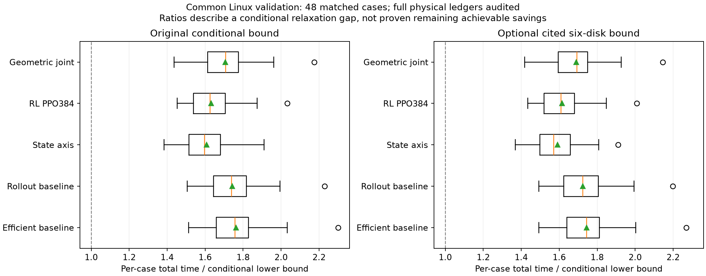

# 公共 48 场景的费用审计与下界差距

这份材料整理已经完成的开发验证，不是论文正文或最终保留测试。当前包含 frozen efficient、frozen rollout、state axis、冷启动后续 PPO002 的第 384 更新模型，以及 geometric joint。每组均是同一套 Linux 生成的 6000–6047：**48 个 case_sha256 完全一致，共 240 条历史全部通过独立物理费用复核、全清且零失败清除。** Geometric single/cross 尚不在本版输入中，不能拿 Windows 训练批次补入本表。

## 当前数值

原条件下界的均值约 **1944.326 s**，可选六圆定理增强后约 **1964.639 s**。各策略只因实际物理动作数不同，逐动作舍入修正在微秒尺度略有差别。

|配置|平均实际时间 / s|平均时间÷平均原下界|平均时间÷平均六圆下界|逐局比值均值：原 / 六圆|
|---|---:|---:|---:|---:|
|Efficient baseline|3413.025|1.7554|1.7372|1.7621 / 1.7437|
|Rollout baseline|3373.253|1.7349|1.7170|1.7430 / 1.7247|
|State axis|3114.002|**1.6016**|**1.5850**|1.6077 / 1.5909|
|RL PPO384|3162.245|1.6264|1.6096|1.6322 / 1.6151|
|Geometric joint|3307.705|1.7012|1.6836|1.7070 / 1.6891|

|配置|原比值 P5 / 中位数 / P95|六圆比值 P5 / 中位数 / P95|原最大比值 / 六圆最大比值|
|---|---|---|---|
|Efficient baseline|1.5699 / 1.7575 / 1.9933|1.5561 / 1.7440 / 1.9630|2.3002 / 2.2688|
|Rollout baseline|1.5258 / 1.7392 / 1.9482|1.5077 / 1.7244 / 1.9185|2.2295 / 2.1990|
|State axis|1.4596 / 1.5968 / 1.7882|1.4431 / 1.5709 / 1.7788|1.9109 / 1.9109|
|RL PPO384|1.4699 / 1.6255 / 1.8063|1.4555 / 1.6092 / 1.7967|2.0327 / 2.0095|
|Geometric joint|1.5050 / 1.7073 / 1.9328|1.4851 / 1.6933 / 1.9077|2.1753 / 2.1455|



箱线图的橙线为中位数，绿色三角为逐局比值的算术平均，箱体为四分位区间；须线使用 1.5 IQR 规则，圆点保留极端场景，不是失败样本，也不等于 P5/P95。两面板使用相同横轴尺度。

`mean(T/L)` 与 `mean(T)/mean(L)` 不同：前者每局等权，后者等于按 L 加权的逐局比值平均。上表明确分开，不把比值的均值当成均值的比值。P5/P95 是这 48 个逐局比值的线性插值分位数，不是参数置信区间。完整每局结果、最低值、最高值、费用分解在 [audit.json](results/audit.json)。

## 下界是什么

设真实源中心为 x_i；从原点出发、终点自由。缓存的 source-edge DP 精确求解图问题：初始边 `max(0,|x_i|−20−ε)`，两源间边 `max(0,|x_i−x_j|−40−ε)`，其中 ε=1e−6 m。任意实际完整清除路线按首次成功清除顺序分段，每段长度至少等于对应圆盘间距离；故图最优值 L_DP 是连续清除圆盘访问路线的下界。**图 DP 精确不等于连续路线已经精确解出**，因为同一圆盘上不同相邻边的最近点可以不一致。

仅看全知物理问题，其下界为 `L_DP/5+5N`，本批均值 **1734.743 s**。按 DP 顺序直接访问真实源中心则给出一个全知物理可行上界，两者差的均值 **97.780 s**。该中心路线依赖预先知道真源，不能作为未知世界中的合法信息获取策略上界，也不能把其上界与真实策略之间的差全部归因于次优调度。

原自洽条件下界已经加入空频道认证信息，不能再叫它纯全知下界。在策略必须对所有合法隐藏场景保证完整清除、且实际 N<16 的前提下，尚有一个空频道容许添加新源；该频道必须由真实测量/失败光学历史排除其所有可能位置。原圆周覆盖松弛给出每空频道至少 30 s 操作成本，若不是初始频道再计至少 1 s 入场换频。全轨迹还需满足覆盖面积必要长度 `L_cert=1120π m`。于是

`LB₀ = max(L_DP,L_cert)/5 + 5N + Σ空频道(30 + 非初始频道指示)`。

同一段移动可同时负责发现和清除，因此取 **max**，不把两个路程下界相加。本批所有 48 局均由 L_DP 主导 max，空频道动作项均值 **209.583 s**。N=16 时，公共数量上界允许清完 16 个源后直接结束，故空频道动作项和 L_cert **同时置零**；本批有 6 个此类场景。

可选六圆增强采用已发表外部定理：六个半径 1000 m 的圆盘不能覆盖半径 1800 m 的圆盘。原作者 1984 年原文 p.150 的 Bemerkung 1 给出覆盖尺度 1.7988…，完整证明转引其 1979 年材料，本项目未亲阅完整证明；这里明确保留这一证据层级。[Bezdek 原刊 PDF](https://annalesm.elte.hu/annales27-1984/Annales_1984_T-XXVII.pdf)

允许失败光学探测时，把其 20 m 圆放大成 1000 m 圆可得 `m+f≥7`，再与原圆周约束及 `5m+3f` 整数费用共同松弛，得到 33/34 s，而不是直接宣布至少七次无线电测量。相对原界只在 N<16 加 `3(20−N)`；本批增量均值 **20.3125 s**，范围 **0–30 s**。**观察到一条轨迹零失败清除，不等于已证明整个策略属于全场景零失败清除策略类**，所以本报告没有采用该较窄类别的 35/36 s 数值。

最后一次性减去 `0.5 微秒×物理动作数 +1 微秒`，覆盖每段移动计时舍入；本批修正范围 57–79.5 微秒。增强版保留同一修正，不二次扣除，也不重复计费。

## 能说明什么

相同场景与口径下，State axis 和 RL 的比值、平均实际时间均优于冻结 rollout，说明当前开发样本上的改进有实际费用证据；本报告本身不替代共享对比脚本的配对置信区间及最终验收。候选和检查点经过开发选择，不能将这里的排名直接声称为独立最终测试结论。

State axis 距原界平均仍有 **1169.676 s**，距六圆界 **1149.363 s**；RL 对应 **1217.919/1197.606 s**。这些是**松弛差距**，不是已经证明还能节省这么多时间。理想最优未知观测策略可能严格高于现有界；差距还含未量化的定位信息成本、耦合路线约束，以及模型和算法的不足。现有证据既不能证明算法不可再优化，也不能证明能逐局逼近 1 倍。

此前独立均匀位置、新测点独立均匀角误差的期望信息论界，只适用于明确的理想化随机模型；官方分布未知，本地误差还是坐标哈希场。**本表没有把那个期望界逐局相加，更没有把经验平均当定理**。同样，240 条记录全清只是物理审计事实，不自行证明用于空频道认证下界的全合法场景策略保证。其适用性仍依赖候选的覆盖与清除证书及正常响应/预算等前提。

## 复核与依赖

`inputs.json` 只列明确授权的开发目录。`audit_gaps.py` 先核对完整 validation manifest、共同协议 SHA、每例 case_sha256、spec SHA 和 rows.json 与压缩物理记录的一致性，再调用此前审过的 `audit_record`，逐条独立重算移动、换频、检测、光学与移除费用，并核对测量/清除反馈、累计时间和全清。

外部依赖为相邻 state 工作树的 `research/theory_v1`：四个已提交辅助脚本逐个锁定 SHA256；代码变化即拒绝执行，不悄悄复制它们到本分支。缓存完整性和每例 geometry_cache_key 均重新核对，未命中就报错。此次 **240 次缓存命中、0 次 DP、0 次新仿真**，审计计算约 0.60 s，源缓存前后 SHA 不变。额外五项构造测试验证均值口径、协议/缺失/越界范围拒绝和外部代码变更拒绝。理论完整证明与界方向说明保留在原 `research/theory_v1`，这里不另造一套公式实现。

```powershell
python -m pytest research/theory_gap_v1/test_audit_gaps.py -q
python research/theory_gap_v1/audit_gaps.py
```

若新增已完成且授权的公共 48 候选，在 inputs.json 增加其明确目录，再运行同一脚本即可；若换平台导致 case hash 改变，必须先另建相应理论缓存，不能依种子名硬配。该入口没有允许扩展到 final/extended/future 的开关。
