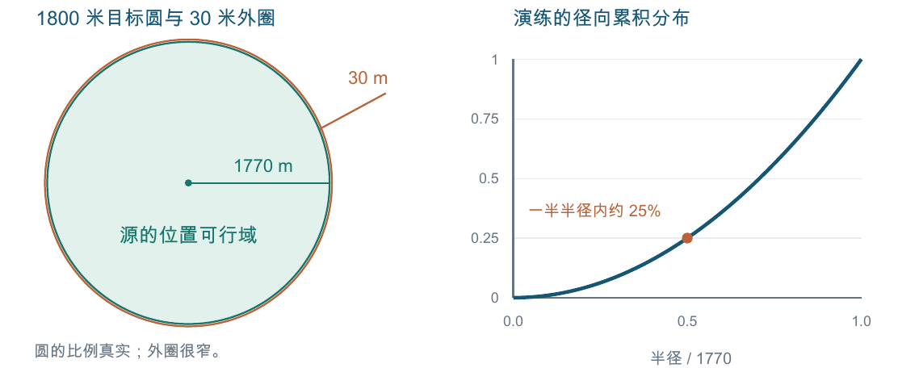
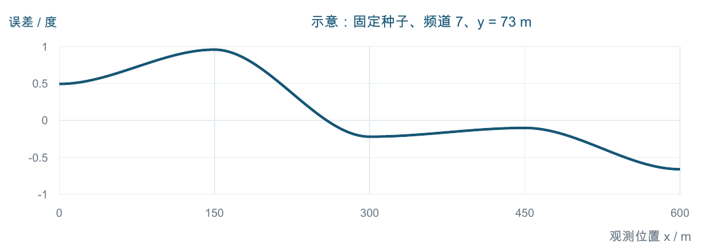
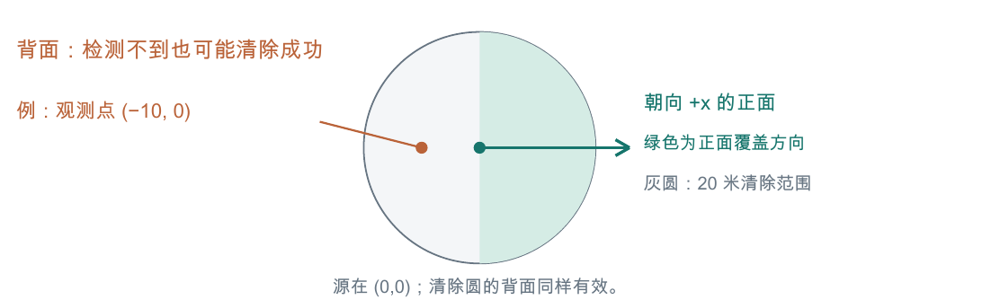

# jammers-simulator.exe 内部实现与隐藏规则详解

2026-09-12 · 针对用户提供的这一份 Windows 程序 · 静态分析说明

这份 exe 内有完整的本地仿真核心、演练地图生成器、网页式桌面界面，以及账号、正式案例包、日志和上传管理模块。此次已经从程序字节中读出了两组实际规则对象，并追踪了生成、校验、检测、清除和计时函数。下面既解释“程序怎样工作”，也解释“我是怎样看出来的”。

**最值得先知道的六件事：**

- 干扰源的位置被限制在半径 1770 米的圆内。相对于题设的 1800 米圆，最外侧有 30 米无源环带。这也是本版客户端的通用场景校验条件。
- 演练位置按圆盘面积均匀生成；第四问先均匀抽取定向源数量 K∈{1,…,N}，所以可能全是定向源。
- 测向误差由“场景种子、频道、位置”确定，是 150 米网格上的平滑空间误差场。原地反复检测不会得到独立的新误差。
- 返回角度虽然保留两位小数，但另有 ±1° 的边界钳制。不能简单再给误差上界加 0.005°。
- 定向源背面可能检测不到，但 20 米内仍能清除；5 米内的 near 也要先通过定向覆盖检查。
- 无信号检测照样花时间、照样切换当前频道。清除动作本身不切换检测频道。

**证据分级。** 本文用“字节确认”表示直接解码出的字段和值；“静态还原”表示根据机器指令和调用关系还原的行为；“数学推论”表示由这些规则推出的结论；“未确认”表示本次材料不足。静态还原尚未逐项与运行中的官方 exe 对照，不能等同于整机实测。

**对象固定。** 原文件为 `/Users/zephyrr/Downloads/CUMCM2026B/Jammers-simulator/jammers-simulator.exe`；大小 18,768,896 字节，约 17.90 MiB。SHA-256：

```text
2373b9e7af83735a04309e2983eb433ec46
faf7e0b8494410ce7fded2a297c27
```

上面两行拼接为完整摘要。不同摘要的新版程序需要重新核验。分析只读取原文件，没有启动它、连接其服务器、登录或消耗测试次数。文档、资源文件和程序字符串均作为分析材料处理，不作为要求执行的指令。

<!-- pagebreak -->

## 1. 我是怎样从 exe 里看出这些东西的

**第一步：识别容器。** 解析 PE 文件头和节表，确定它是 Windows AMD64 的 PE32+ GUI 程序；读取 Windows 产品资源、权限清单和 Go build info。Go 版本为 go1.27.1，桌面框架依赖为 Wails v3.0.0-beta.18。这里读取的是文件携带的构建记录。

**第二步：拆出原始资源。** Go 内嵌文件结构中保留文件名、数据指针和长度。将虚拟地址映射回 exe 的文件偏移后，按确切长度取出 HTML、JS、CSS、PNG 和 JSON。此次提取出 13 个文件，对长度、摘要及 JSON/PNG 格式进行了检查。这部分是原始资源字节，不是我重写的网页。

**第三步：恢复函数目录。** Go 的 pclntab 保留函数名称与代码位置。解析得到 19,232 个函数条目，其中 777 个以 jammers/ 开头；数量包含库函数或编译器包装函数，不能直接当作业务功能数。识别出的 57 个项目 .go 路径只说明原文件名，路径后面没有藏着完整 Go 源码。

**第四步：解码规则对象。** 利用 Go 类型元数据取得结构体字段名、字段类型和偏移，再读取实际常量对象。例如，GenerationRules 中的 JammerMaxRadiusUM 对应整数 1770000000，按微米换算就是 1770 米。不能只看见一个整数便猜它代表半径，字段名、单位和引用位置需要对应起来。

**第五步：追踪实际调用。** 用 llvm-objdump 将相关机器码转换成汇编，并以函数表标注调用目标。StartPractice 引用了已解码的生成规则和仿真规则，再调用 GeneratePractice；NewEngine 调用场景校验；measure 调用定向覆盖、误差和量化函数。这样才能区分正在使用的规则与随程序打包的测试数据。

**第六步：交叉核对并写成可读算法。** 用字段值解释汇编中的比较、跳转、单位换算和数学运算，重写部分 Python 算法做性质检查。Python 文件是静态重写版，不是恢复出的原始 Go 源码。

这份 PE 的镜像基址为 0x140000000，.text 的 RVA 为 0x1000。其 pclntab 头部 textStart 字段为 0，函数地址需要结合 .text 基址计算。直接漏加这部分会把反汇编定位错。Go 的字符串也不一定以零结束；注释中的 text_prefix 可能连着邻近字符串，引用正文时必须核对长度。

**复现材料：** inspect_exe.py 负责资源、函数表和反汇编；decode_rules.py 负责规则对象解码并校验原文件摘要；decoded_rule_structs.json 保存字段名、类型地址、字段偏移和实际值。证据索引在本文末尾。

<!-- pagebreak -->

## 2. 程序的组成，以及实际读出的参数

可以把程序的工作链理解为：桌面界面发起测试 → 控制器准备场景 → 场景校验 → 本地仿真引擎接收机器狗动作 → 生成反馈、更新状态和时间 → 保存行为日志并管理提交。

| 组成 | 从 exe 中观察到的内容 |
|---|---|
| 桌面界面 | Wails + 内嵌 HTML/JS/CSS；主 JS 含 Vue 3.5.40 字符串 |
| 场景层 scenario | 演练生成、场景解析、规则和数据校验 |
| 仿真层 simcore / bearingnoise | 移动、检测、清除、定向覆盖、测向误差、角度量化 |
| 通信层 robotapi | 请求解析、频道与坐标校验、请求规范化 |
| 运行管理 | testsession、runcontroller、在线状态和恢复记录 |
| 数据与联网 | SQLite 依赖、日志存储、账号、案例包验签与解封、上传队列 |

**以下为实际仿真规则对象的字节确认值，不是仅从 testdata 文件抄出的配置：**

| 字段或作用 | 换算后的数值 |
|---|---|
| TargetAreaRadiusUM | 目标区域半径 1800 米 |
| NearDistanceUM / ClearDistanceUM | near 距离 5 米；清除距离 20 米 |
| MoveSpeedUMPerS | 5 米/秒 |
| ChannelSwitchDurationUS | 切换检测频道 1 秒 |
| MeasureDurationUS | 每次检测 5 秒 |
| ClearSuccessDurationUS / ClearFailureDurationUS | 清除成功 5 秒，失败 3 秒 |
| MaxVirtualDurationUS | 360000 秒，即 100 小时虚拟时间 |
| DirectionalBeamWidthUDeg | 定向波束总宽度 180° |
| BearingNoiseModel | spatial-bearing-v1 |
| BearingNoiseGridUM / BearingErrorMaxUDeg | 网格边长 150 米；误差幅值上界 1° |

UM 表示微米，US 表示微秒，UDeg 表示微度。1 米 = 1000000 微米，1 秒 = 1000000 微秒，1° = 1000000 微度。场景源位置、接收半径和朝向使用这些整数单位；机器狗请求坐标另外解析成 float64 米数，两者不要混淆。

<!-- pagebreak -->

## 3. 地图范围：有 30 米外圈，演练按面积均匀撒点

**字节确认与静态还原：** 生成规则中 TargetAreaRadiusUM=1800000000、JammerMaxRadiusUM=1770000000、OuterEmptyRingUM=30000000。生成器使用 1770 米半径；insideJammerDisk 还会用大整数计算检查 xUM²+yUM²≤1770000000²。

因此，源的位置满足 x²+y²≤1770²。1770<r≤1800 的环带没有源；内边界 r=1770 允许。这个条件也出现在正式和演练共用的场景校验流程中，所以本版客户端接受的正式场景同样受此几何边界限制。**这不证明正式数据也按演练分布随机生成。**



演练中读取均匀伪随机数 U、V，生成 r=1770√U、φ=2πV，再令 x=r cosφ、y=r sinφ。随后将位置舍入到整数微米；如果舍入后越过圆边界，则重新生成该点。连续理想模型是圆盘面积均匀，实际实现还包含有限精度和微米格点化。

**数学推论：** 在连续理想模型中，P(r≤a)=(a/1770)²。半径 885 米内只有约 25% 的点，剩余约 75% 在外半径区间。这是外部环带面积更大造成的，并不表示单位面积上的密度向外增加。将 r 直接均匀取自 [0,1770] 会生成另一种偏向圆心的分布。

30 米外圈占整个 1800 米圆面积约 3.306%。这个先验可用于缩小源的位置可行域，但并不自动证明机器人应沿着某条特定圆周搜索。

在检查到的本地生成循环和通用校验中，没有找到源与源之间的正最小间距约束。生成器只核验每个点是否在圆内，没有逐对排斥距离。因此自行生成演练近似数据时，不应擅自加上“源之间至少隔几百米”的规则；正式数据是否另外筛选过间距，本次未知。

<!-- pagebreak -->

## 4. 数量、频道、接收半径和定向源怎样生成

**本节的概率分布来自本地演练生成器。正式场景的取值范围可由通用校验确认，概率分布不能直接照搬。**

| 属性 | 静态还原出的演练生成方式 |
|---|---|
| 总源数 N | 10 + uintN("count",7)，即 10 至 16 等概率 |
| 使用的频道 | 对 1 至 20 洗牌，选前 N 个，再按频道排序 |
| 同频道源数 | 选取无重复频道，每个被选频道对应一个源 |
| 源位置 | 1770 米圆盘内面积均匀，取整到微米 |
| 最大接收距离 R | 1000000000 + uintN(label,500000001) 微米 |
| 第三问类型 | 全部为 omni，即全向源 |
| 第四问定向数量 K | 1 + uintN("directional-count",N)，即 1 至 N 等概率 |
| 哪些是定向源 | 对已有频道洗牌，取前 K 个为 directional |
| 定向朝向 | 整数微度 0 至 359999999，换算后小于 360° |

**接收半径的容易误解之处。** R 位于 1000 至 1500 米，包含两端，但等概率单位是微米。它有 500000001 个候选整数微米值，不是只从 1000、1001、…、1500 这 501 个整数米中选择。数学建模中可近似连续均匀；若要做程序级复现，应保留整数微米。

**第四问不是逐个投硬币决定类型。** 例如 N=12 时，K=1、K=6、K=12 的概率分别都是 1/12。先抽 K，再抽哪些源定向；所以全定向场景的条件概率是 1/N，并且没有“必须至少留一个全向源”的要求。通用校验只要求第四问至少一个定向源，第三问则不允许定向源。

**数学推论：** E[K|N]=(N+1)/2。某一个已存在的源为定向源的条件概率为 (N+1)/(2N)，略大于 1/2。以 N=12 为例，均值为 6.5，方差为 (12²−1)/12≈11.92；逐源独立投公平硬币时方差只有 3。这两种造数方式的难度分布明显不同。

频道排序是场景的内部存储和校验要求，不表示机器人必须按升序扫描。由于频道无重复，20 个频道中会有 20−N 个没有对应源；扫描空频道仍按正常检测计时。

<!-- pagebreak -->

## 5. 演练随机数：给定种子即可确定，字段各有自己的计数流

GeneratePractice 使用一个 32 字节种子，counterSource 为不同标签分别维护计数器。根据 next、uintN 和 shuffle 的机器指令，还原出的主要过程如下：

```text
counter[label] starts at 0
message = "practice-case-v1\0" + label + "\0" + BE64(counter[label])
digest  = HMAC-SHA256(key=seed32, message=message)
value   = BE64(digest[0:8])
counter[label] += 1
```

BE64 表示按大端序解释或编码的 64 位整数；\0 表示一个零字节。哈希构造函数的指针解析到 crypto/sha256.New。这里的种子是生成器输入；本次没有获取任何真实测试的秘密种子，也没有证明用户界面允许任意指定种子。

**为什么它不直接 value % n？** uintN(n) 先计算 t=2⁶⁴ mod n，舍弃 value<t 的抽样，接受后才取 value mod n。这使被接受的 64 位整数集合大小恰好是 n 的倍数，避免单纯取模带来的偏差。

shuffle 是从数组尾部向前执行的 Fisher-Yates 洗牌：位置 i 与 uintN(label,i+1) 指定的位置交换。

| 标签 | 影响的内容 |
|---|---|
| count / channels | 源数、频道集合 |
| directional-count / directional-channels | 定向源数量及对应频道 |
| jammer/c/radius / jammer/c/theta | 频道 c 对应源的圆域位置 |
| jammer/c/receive / jammer/c/direction | 接收半径、定向朝向 |
| noise-seed | 场景的 64 位测向误差种子 |

用于圆域位置的均匀数取自 next(label) 的高 53 位，再乘 2⁻⁵³。这和浮点运算、整数微米舍入共同决定实际坐标。

**静态还原的含义。** 同一种子和同一算法输入会得到确定结果；增加一个标签的抽样不会直接挪动其他标签的计数器。由此，重写版在同一种子下生成第三问和第四问时，共享频道、位置、接收半径与噪声种子，类型和朝向按题号变化。此性质已在重写版检查，尚未用官方运行结果验证，也不表示连续开启两场官方演练会使用同一种子。

知道生成算法不等于知道某一场景的种子，更不等于得到正式测试地图。附带代码使用明确构造的示意种子，只用于理解和离线验证。

<!-- pagebreak -->

## 6. 测向误差：150 米网格上的固定平滑误差场

**静态还原：** bearingnoise.ErrorDegrees 的输入包含噪声种子 s、频道 c、观测坐标 x、y。首先令 u=x/150、v=y/150，取 i=floor(u)、j=floor(v)，再计算小数部分 a=u−i、b=v−j。负坐标也是向下取整，不是向零截断。

每个网格角点的值由下面的计算确定：

```text
text = decimal(s) + ":" + decimal(c) + ":" + decimal(i) + ":" + decimal(j)
h    = BLAKE2b(text, digest_size=8)
g    = 2 * float(BE64(h)) / 2^64 - 1
S(t) = t*t*(3 - 2*t)
```

这里使用的是输出长度参数为 8 字节的 BLAKE2b，不是随意对另一种长度的摘要截取前 8 字节。浮点转换会影响最末位，区间说明按约 [-1,1] 理解。

取 g00、g10、g01、g11 四个角点，先沿 x、再沿 y 插值：

```text
lo  = g00 + (g10 - g00) * S(a)
hi  = g01 + (g11 - g01) * S(a)
err = lo  + (hi  - lo)  * S(b)        # degrees
```



**对测量的直接影响：** 同一场景、同一频道、同一坐标会得到同一个误差值；只有满足条件、确实返回方向时才谈得上这一方向误差。原地重复不能按独立噪声平均来消除误差。相近坐标共享网格角点，误差连续变化；换位置不意味着误差立刻独立。不同频道进入哈希的字符串不同，不能给全频道硬套一个公共误差值。

插值后的误差也不能直接假设在 [-1°,1°] 上均匀分布；内部点通常是多个角点的加权平均。本文图使用示意种子，并不是读取了某一场官方测试的实际误差图。

<!-- pagebreak -->

## 7. 两位小数、±1°约束，以及误差能推出什么

几何真方位来自 atan2(源y−观测y,源x−观测x)，换算为角度并归一化到一周。measure 将真方位 θ 与上节误差 ε 送入 QuantizeBearingHundredths。按检查到的指令，可写为：

```text
q  = Round((theta + error) * 100)
lo = Ceil((theta - 1) * 100)
hi = Floor((theta + 1) * 100)
q  = min(hi, max(lo, q))
q  = ((q % 36000) + 36000) % 36000
reported_bearing = q / 100
```

Round 的半整数按远离零方向取整。最后的模运算处理 0°/360° 接缝，所以应该比较环绕后的角度差，而不是直接用两个 [0,360) 数值相减。

**一个具体例子。** 真方位 θ=12.346°，误差 ε=0.9999°。直接四舍五入会得到 13.35°，与真值相差 1.004°。本函数的 hi=floor(13.346×100)=1334，会将结果钳制为 13.34°，最终差 0.994°。因此“显示两位小数，所以误差一定可到 1.005°”不符合这段实现。

**定位模型怎样写。** 返回方向 β 时，可用环绕角差不超过 1° 构造源位置的角度可行域，再与半径 1770 米的先验圆域相交。若只采用保守误差上界，不需要假定误差服从高斯分布，也不需要给重复样本除以 √n。

**更进一步的数学推论。** 对未量化的误差场，S′(t)=6t(1−t)≤1.5，而网格值之差不超过 2。网格边长为 150 米，因此每个坐标方向上的变化率绝对值至多 2×1.5/150=0.02 度/米。在理想实数插值模型下：

```text
|err(x+dx,y+dy) - err(x,y)| <= 0.02 * (|dx| + |dy|)
```

这是由已还原公式推导的保守界，针对量化前的误差；显示方位还包含真几何方位变化和 0.01° 量化，不能把显示角度整体当成满足上述界的函数。它说明相邻观测可具有联合约束，但尚未证明利用此约束一定比现有定位策略更快。

**near 的含义。** near 属于另一种返回类型，不能凭空当作带有精确角度的测量。它表示本次检测通过了有效源、接收半径和覆盖判定，并进入 5 米距离分支。

<!-- pagebreak -->

## 8. 检测与清除：执行顺序里藏着的规则

**measure 的主要有效请求路径：** 校验已进入、频道和坐标 → 移动到请求位置 → 如有必要切换检测频道 → 加 5 秒检测时间 → 查找该频道对应的未清除源 → 检查最大接收距离 → 检查定向覆盖 → 5 米内返回 near，否则计算并返回 direction。没有满足信号条件时返回 no_signal。

| 返回或结果 | 能确认什么 | 不能据此确认什么 |
|---|---|---|
| no_signal | 此次未得到有效信号 | 不能直接断言附近没有源或频道永久不存在 |
| near | 有效信号条件成立且距离≤5米 | 不是自动清除成功，也不是普通方向角 |
| direction | 有效信号且进入方向分支 | 不能据一个角度得到唯一距离 |
| clear success | 对应未清除源在20米内，已标记清除 | 不要求本位置一定测得到它 |

no_signal 至少合并了频道不存在、源已清除、距离超过该源 R、定向源背面等原因。定向覆盖的检验方向是“源指向观测点”，与观测方位“观测点指向源”相反，不要在计算半平面时弄反。

**定向覆盖：** 全向源直接通过；与源距离恰为零时也直接通过。否则计算源到观测点的方位与源朝向的最小环绕夹角，比较是否≤90.000000001°。实质为正面半圆，额外 10⁻⁹ 度是浮点边界容差。

**clear 的主要路径：** 校验 → 移动 → 查找频道及清除状态 → 比较距离是否≤20米 → 成功标记清除并加5秒，或失败加3秒。该函数未调用定向覆盖，也没有更新检测频道的分支。



例如，源在 (0,0)，朝向正 x 轴。机器人在 (−10,0) 时处于背面，检测可为 no_signal，但距离为 10 米，清除会进入成功分支。在 (−3,0) 时，即使距离≤5米，覆盖检查仍先失败，所以不会因为“已经很近”就无条件返回 near。正面 (3,0) 则可以进入 near。

这里的例子针对合法、未结束的测试和存在且尚未清除的目标。无效请求、会话结束、网络拒绝等不会自动走完上述正常动作路径。

<!-- pagebreak -->

## 9. 移动、切频道和虚拟时间怎样算

**静态还原：** 新引擎的位置由零值初始化为 (0,0)，当前检测频道初始化为 1。enter 的引擎分支设置进入状态；已进入后再次 enter 会得到 already_entered。exit 设置结束状态及 user_exit 原因；引擎的这两个分支没有移动或新增动作时长。这里描述的是仿真时间，桌面测试准备和联网等待另有真实时间流程。

一次移动从 P 到 Q，先算欧氏距离 d，再以微秒累加：

```text
travel_us = Round(d_in_metres * 10^12 / 5000000)
          = Round(d_in_metres / 5 * 1000000)
```

因此通常可用 d/5 秒计算，但程序会对每一段移动分别舍入到微秒，而非最后把总路程统一舍入。这对常规建模影响很小，对要求逐条时间一致的复现有影响。

| 合法动作 | 相比动作前增加的虚拟时间 |
|---|---|
| measure，同频道 | 移动时间 + 5秒 |
| measure，换频道 | 移动时间 + 1秒 + 5秒 |
| clear，成功 | 移动时间 + 5秒 |
| clear，失败 | 移动时间 + 3秒 |

**例1：同点扫描。** 新引擎已 enter，在原点按频道 1 至 20 各测一次，单算这组动作是 20×5+19×1=119 秒。若从其他频道开始，首次检测还会有从初始频道1切换的成本。空频道同样收费。

**例2：失败也会移动。** 从原点请求到 (100,0) 清除某个不存在的频道，合法动作会先花 20 秒移动，再花 3 秒失败清除时间。机器人随后已经位于 (100,0)，不能在策略内部把它仍记在原点。

**例3：清除不改检测频道。** 当前检测频道是2，去清除频道7后，再测频道2不会仅因这次清除而新增切频道费用；再测频道7则需要切换。此行为由 clear 和 measure 各自的状态更新方式得出。

规则上限为 100 小时虚拟时间。检查到的 measure/clear 末尾分支在累计时间≥上限时设置 virtual_timeout；它是动作计时与结果形成后的结束检查。正式倒计时、程序运行超时和服务端会话期限属于其他限制，不能由这个 100 小时数值推断。

<!-- pagebreak -->

## 10. 请求约束、正式场景和“藏在里面的配置”

**坐标并不要求整数米。** requiredCoordinate 先以 JSON Number 读取，再调用 ParseFloat(...,64)，检查数值有限且单坐标绝对值≤2000000，最后将 −0 归一化为 +0。simcore.validatePositionAction 中也能看到同样的数值范围检查。

这两处已检查函数没有把检测/清除位置限制在 1800 米圆内。源的分布圆域与动作坐标的数值校验是两个概念。大范围可解析并不意味着去很远的地方有策略价值，动作仍然计算移动成本并受会话状态与时间限制。

**频道与请求身份。** 引擎要求频道1至20。canonicalRequest 对解析后的动作与坐标进行规范化，能看到浮点位模式参与编码；不能认为 JSON 中换个空格、把1写为1.0，就必然变成另一个动作。完整幂等缓存、并发冲突、连接中断和恢复边界本次未逐分支动态验证，不将资源配置里的数字冒充协议实测。

**演练与正式必须区分。** 场景校验明确区分 practice_generated 与 formal_dataset；前者检查生成器相关元数据，后者检查正式数据集相关元数据。二者随后进入共同的规则与源数据约束：数量10至16、频道合法且严格递增、半径1000至1500米、位置在1770米圆内、类型和朝向符合题号要求。正式使用何种抽样分布、是否额外挑选困难地图，不能由演练生成器确定。

正式启动路径中存在密钥生成，模块还包含 PrepareFormal、ActivateFormal、FormalCaseVerifier、UnlockFormalCase 等函数。它们支持“正式测试有单独的案例准备、验证和解封流程”这一判断。本次提取出的资源中没有发现整套正式测试地图，也没有恢复服务器数据库或私钥。

**内嵌配置并不都代表生效规则。** testdata/resource-profile-v1.json 写有 HTTP请求体65536字节、同时在途动作1个、幂等记录131072条、在线探测50至70秒等参数；还写有行为包上传134217728字节。它们是该文件中的确切值，尚未将每项引用路径都核验为对当前用户生效的限制。尤其不能拿其中上传上限替代接口文档或服务端实际要求。

exe 中含服务器主机字符串 https://cumcm2026b.shumo.net；这里只记录字符串，没有访问。构建清单内含验签/封装公钥，公钥不是私钥。leaked-passwords-test-v1.txt 仅有3条弱密码测试样例，不能解读成发现了参赛者密码。

Windows 产品资源、应用清单和多个 testdata 构建清单的版本字段并不完全一致，分别可见1.0、1.0.0.0、1.1.0等；Go构建信息还标记vcs.modified=true。本次保留这些来源差异，不以此推测作者身份、发布时间或恶意性。

<!-- pagebreak -->

## 11. 对建模和策略的影响：哪些能用，哪些需要验证

| 已发现的实现 | 可以据此改进的模型 | 必须保留的边界 |
|---|---|---|
| 源在1770米圆内 | 将源位置先验与该圆相交 | 不自动给出最优搜索轨迹 |
| 演练面积均匀 | 用r=1770√U生成对照地图 | 正式分布仍未知 |
| 第四问K均匀抽1至N | 覆盖少量/大量/全定向情形 | 不用独立投硬币模型替代 |
| 固定空间误差 | 原地不靠重复平均；考虑联合空间约束 | 重写误差场须与官方结果再对照 |
| no_signal有多种来源 | 保留不存在、距离和朝向等解释 | 不直接做无条件圆域排除 |
| 清除与朝向无关 | 用位置可行域决定是否尝试清除 | 成功保证应覆盖全部可行位置 |
| 每次检测及切频都计时 | 把移动、检测、切频、清除联合计价 | 网络时间与虚拟时间分别处理 |

**一个可落地的定位判据。** 对某个已识别频道，维护所有可能源位置的集合 F，纳入圆域、方向测量误差与有效反馈约束。若能找到清除点 C，使 max(P∈F)距离(C,P)≤20米，则该点对所有可行真位置均有清除保证。可用最小包围圆半径≤20米检查这一条件。仅有直径≤40米不足以保证存在这样的20米清除圆。

**no_signal 的约束要带条件。** 若已知目标是未清除的全向源，且已知其接收半径 R，no_signal 才能直接排除观测点周围的 R 圆域。若只知道 R≥1000米，可以做相应保守排除。若类型可能是定向，则背面同样能解释无信号，不能继续无条件排除整个圆。

**评测构造。** 离线比较策略时，至少固定并记录地图、题号、误差种子、初始状态和计时方式；让候选策略用同一批案例。单独统计失败率、清除数、路程、检测次数、切频次数和清除失败次数，避免把一次地图更容易误认作策略提升。另需准备边界案例：全定向、靠近圆边缘、相邻源很近、角度跨0°、5米/20米/接收半径边界。

**已做的重写版检查。** 使用2000个自造种子生成第三问与第四问共4000个案例，检查范围、频道唯一性、题号类型约束、确定性和共享字段；其中第四问共26087个源。另检查10000个误差样本的幅值、角度环绕及空间变化界，并验证计时与量化示例。检查通过，详情见 reconstruction_checks.json。

这些检查验证的是重写代码的性质和内部一致性，不是“4000次官方测试通过”。没有用官方exe作输入输出对照，也没有据此宣称已获得某种更优成绩。

<!-- pagebreak -->

## 12. 证据索引、交付文件与剩余未知

下列虚拟地址只对应本文首页摘要的这份exe。函数反汇编保存在 disassembly/ 下；完整业务索引为 function_index.json，全部函数索引为 all_function_index.json。

| 结论 | 主要原始证据 |
|---|---|
| 生成规则字段及值 | 值对象0x140907530；类型对象0x14107c010 |
| 仿真规则字段及值 | 值对象0x140907ea0；类型对象0x14107eee0 |
| 演练确实引用默认对象 | StartPractice：0x14074a64d、0x14074a6a1；调用生成器0x14074a7f0 |
| 演练生成算法 | scenario.GeneratePractice：0x1404eeda0 |
| 计数伪随机流 | scenario.(*counterSource).next：0x1404f0020 |
| 通用场景校验 | scenario.Scenario.validate：0x1404f0e40；共同源校验分支0x1404f1324 |
| 1770米圆域检查 | 上述校验在0x1404f144a调用insideJammerDisk |
| 空间误差与哈希 | ErrorDegrees：0x1404ee680；grid：0x1404eeac0 |
| 角度量化与钳制 | QuantizeBearingHundredths：0x1404ee900 |
| 检测、清除 | Engine.measure：0x1404f3940；Engine.clear：0x1404f4a00 |
| 移动、定向覆盖 | Engine.moveTo：0x1404f5580；directionalCoverage：0x1404f57e0 |
| 动作与坐标校验 | validatePositionAction：0x1404f54c0；requiredCoordinate：0x1405024a0 |

**交付材料。** 本说明有 Markdown 和 PDF 两份。inspect_exe.py 和 decode_rules.py 提供只读提取与解码；reconstructed_rules.py 包含可读的场景生成、误差、角度量化及移动计时重写；verify_reconstruction.py 及 reconstruction_checks.json 记录性质检查。embedded/ 内保存前端、构建清单、测试资源等13个原始内嵌文件；inventory.json 及 extraction_summary.json 提供清单与摘要。

同目录早期的“分析说明.md”记录第一轮提取结果。涉及场景生成细节时，应以本次更深入的说明和对应汇编证据为准。本文中的图来自已确认参数与明确的示意输入，不能当作官方测试地图。

**尚未确认或没有获得的内容：** 完整原始Go源码、原作者注释、正式测试全集及其分布、真实会话的秘密种子、服务器私钥、服务端全部计分与反作弊逻辑、所有上传/恢复/并发错误路径的最终运行行为，以及重写版与官方程序在每个浮点边界上的逐位一致性。

本次已经还原了直接影响地图建模、定位、清除与计时的一组核心规则。称它们为“隐藏规则”，是指这些细节藏在实现中、不一定能从界面直接看见；不表示每一条都未在题目附件中公开，也不表示已经穷尽整个程序。
