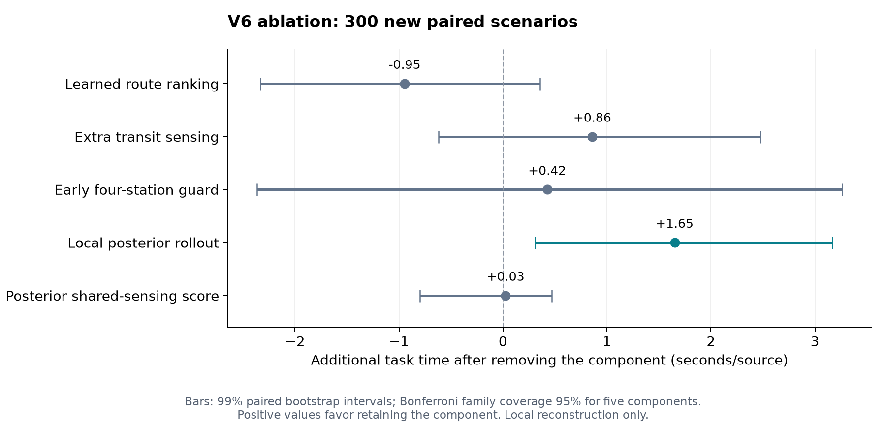
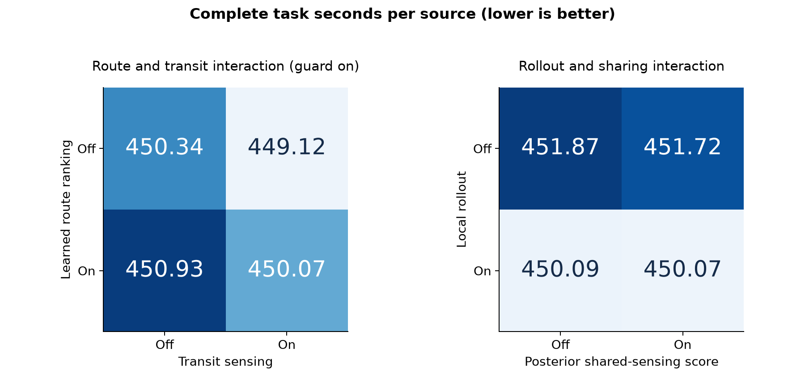

# V6 组件消融实测

本轮将 V6 拆为五个独立组件，用 12 个预先固定的配置进行同场景对照。模型权重、候选点规则、默认预算及模拟器均保持冻结，未针对消融版本重训或调参。

新测试共 **300 个随机场景、70 个压力场景**，每场运行全部 12 个版本，合计 **4,440 次新场景运行**。另有此前 3 个失败模式案例的 36 次诊断运行，不混入新测试均值。新场景包含 4802 个源实例，各版本均全清，共 57624 次成功清除。

完整 V6 在这批新随机场景的平均完整任务耗时为 **450.066 秒/源**；V4 为 454.150，V5 为 450.343。这是新的一批地图，不与上一批 450.967 秒/源直接相减判断提速。所有数字均为本地复原模拟器结果。

## 主要发现

- 局部前瞻值得保留：随机主测试中关闭后平均多用 1.651 秒/源，五项校正后的区间仍为正；代价是较高计算成本。
- 沿途检测的收益依赖分布：随机组单项效果尚不确定，但边界朝外组关闭后平均增加 50.734 秒/源，沿途学习评分换成几何收益也增加 41.010 秒/源。这一组的主要降时来源很明确。
- 前期保护不能只按均值评价：主测试均值效果尚不确定，但去掉保护后，相对 V4 的最差退步从 14.495% 增加到 32.701%。这是样本中的风险迹象，不是尾部保证。
- 当前学习路线重排没有稳定的正收益证据：关闭后主测试均值反而减少 0.945 秒/源，但校正区间跨零。因此可把“不做学习重排”作为后续独立验证的简化候选，不能直接宣称更快。
- 后验共享评分的增益很小：退回 V4 共享启发式后，主测试均值仅增加 0.025 秒/源，校正区间跨零。这里保留了共享补测机制，只替换收益估计，可优先评估是否值得保留这部分计算。

## 为什么要拆开原开关

`use_v5_local=False` 实际同时关闭局部前瞻和后验共享评分，不能用它单独评价“局部前瞻”。本轮新建独立消融控制器，未修改原源码。全开版、V5、V4 在随机、全定向、边界三类场景与原版逐动作、逐反馈一致；原有四种公开开关组合也核对一致。另用测试确认：关闭前瞻时后验共享仍运行；关闭后验共享时前瞻仍运行。

| 组件 | 本轮关闭/替换的内容 | 仍保留的行为 |
|---|---|---|
| R 学习路线重排 | 不调用学习模型改变下一任务 | V4 全局路线规划 |
| T 沿途额外停测 | 不插入路段中间的额外测量 | 正常扫描、定位测量和普通共享补测 |
| G 前四站保护 | `minimum_stations=0` | 合法动作与有限预算 |
| L 局部前瞻 | 不采样模拟候选定位动作的后续成本 | V4 保守几何定位 |
| S 后验共享评分 | 共享补测决策退回 V4 三点启发式 | 共享补测机制本身 |

覆盖认证、保守几何误差界、真实成功清除判定、源数上界终止条件不作为可删组件。移除这些条件会改变任务的正确性标准。

## 五项主要消融

下表“关闭后的增量”=关闭该组件后的平均 T/N−完整 V6 的平均 T/N。正数表示保留该组件有利，负数表示关闭后更快。区间使用 50,000 次同案例配对 bootstrap；每项取 99% 区间，对预先指定的 5 项作 Bonferroni 校正，合计名义覆盖率至少 95%。它不包括复原模型误差。

| 关闭的组件 | 关闭后秒/源 | 增量秒/源 | 校正区间 | 本批证据 |
|---|---:|---:|---|---|
| 关学习路线重排 | 449.120 | -0.945 | [-2.332, +0.354] | 均值效果尚不确定 |
| 关沿途额外停测 | 450.925 | +0.859 | [-0.621, +2.477] | 均值效果尚不确定 |
| 关前四站保护 | 450.491 | +0.425 | [-2.366, +3.262] | 均值效果尚不确定 |
| 关局部前瞻 | 451.717 | +1.651 | [+0.308, +3.169] | 保留有收益 |
| 后验共享评分退回 V4 启发式 | 450.091 | +0.025 | [-0.799, +0.469] | 均值效果尚不确定 |



“区间跨零”表示当前数据不足以确认该组件对均值的影响，不代表证明它无用或与原版等价。每项差值都是在其他组件仍开启的条件下计算，不能机械相加成总收益。

## 全部 12 个配置与计算成本

计算时间另用冻结随机场景前 20 场单进程复跑，共 240 次；模型、模块和布局证书预先载入，包含策略及本地协议处理，排除文件压缩、导出与事后审计。所有复跑轨迹与对应批量记录一致。

| 配置 | 主测试秒/源 | 比完整 V6 节时 | 串行 CPU 秒/场 | 比 V4 最差退步 |
|---|---:|---:|---:|---:|
| V4 基准 | 454.150 | -0.908% | 0.0264 | 0.00% |
| V5 基准 | 450.343 | -0.062% | 0.4608 | 8.44% |
| 完整 V6 | 450.066 | +0.000% | 0.4533 | 14.50% |
| 关学习路线重排 | 449.120 | +0.210% | 0.3807 | 15.38% |
| 关沿途额外停测 | 450.925 | -0.191% | 0.5415 | 10.90% |
| 关前四站保护 | 450.491 | -0.094% | 0.4851 | 32.70% |
| 关局部前瞻 | 451.717 | -0.367% | 0.1490 | 20.87% |
| 后验共享评分退回 V4 启发式 | 450.091 | -0.006% | 0.4011 | 14.39% |
| 同时关前瞻和后验共享评分 | 451.874 | -0.402% | 0.0996 | 20.37% |
| 沿途学习评分改为几何收益 | 451.532 | -0.326% | 0.4008 | 15.37% |
| 仅路线学习、不设前期保护 | 450.133 | -0.015% | 0.5640 | 28.51% |
| 仅沿途学习、不设前期保护 | 448.179 | +0.419% | 0.4013 | 14.68% |

## 组件相互作用

同时测了 R/T 的 2×2 组合，并在有保护、无保护两种条件下重复；另测 L/S 的 2×2 组合。下列交互量以任务成本计算：T11−T10−T01+T00。负值表示二者同时存在时的降时超过简单相加，正值表示收益存在重叠或互相抵消。其区间是探索性的单项 95% 区间，未纳入上述五项的多重比较校正。

- R×T，四站保护：交互量 +0.364 秒/源，区间 [-0.565, +1.293]。
- R×T，无前期保护：交互量 +2.522 秒/源，区间 [+0.268, +4.871]。
- L×S，完整学习控制：交互量 +0.132 秒/源，区间 [-0.034, +0.336]。



把沿途学习评分改成几何收益后，成本变化为 +1.467 秒/源，单项 95% 区间 [+0.469, +2.501]。两者使用相同候选点、预筛规则和 16 次停测预算；几何版选最大几何收益并接受正收益候选。因此这项比较同时替换了评分排序和接受决策，不是单独的“树模型计算速度”消融。

## 前期保护与 16 源案例

- 完整 V6：相对 V4 的最差个例退步 14.50%，退步比例的 95 分位数 3.97%。
- 关前四站保护：相对 V4 的最差个例退步 32.70%，退步比例的 95 分位数 5.70%。
- 关学习路线重排：相对 V4 的最差个例退步 15.38%，退步比例的 95 分位数 3.49%。
- 仅沿途学习、不设前期保护：相对 V4 的最差个例退步 14.68%，退步比例的 95 分位数 4.52%。
- 关沿途额外停测：相对 V4 的最差个例退步 10.90%，退步比例的 95 分位数 3.61%。
- 仅路线学习、不设前期保护：相对 V4 的最差个例退步 28.51%，退步比例的 95 分位数 6.84%。

新随机场景中有 36 场实际含 16 个源。以下真实数量只在事后分组中使用，不提供给策略：

| 配置 | 16 源场景秒/源 | 最后发现频道时刻/秒 | 访问固定站数 |
|---|---:|---:|---:|
| V4 基准 | 315.131 | 4351.562 | 15.56 |
| V5 基准 | 306.618 | 4213.755 | 15.25 |
| 完整 V6 | 306.620 | 4148.011 | 14.94 |
| 关前四站保护 | 310.206 | 4376.224 | 16.14 |
| 关学习路线重排 | 304.126 | 4108.188 | 14.86 |
| 关沿途额外停测 | 308.093 | 4234.981 | 15.31 |
| 关局部前瞻 | 313.485 | 4296.364 | 15.42 |
| 后验共享评分退回 V4 启发式 | 305.046 | 4088.856 | 14.69 |

这些极值与分位数是本批观测，尤其最差个例只由单个场景决定；不能据此证明总体尾部风险已经受控。

已知案例的反例也值得保留：在此前 `main-0096` 中，关闭学习路线重排把完整任务从 5819.621 秒降至约 4601.1 秒；但此前 `main-0291` 中，同一改动把 3366.838 秒增加到约 4369.1 秒。`main-0180` 关闭重排后仍约 5283.8 秒，未修复相对 V4 的退步。这些是选定的诊断案例，不是独立验证，也不能用单例证明某组件总有用或总有害。

## 压力分布单独列示

| 配置 | 全定向秒/源，35 场 | 边界朝外、R=1000 秒/源，35 场 |
|---|---:|---:|
| V4 基准 | 482.702 | 574.193 |
| V5 基准 | 473.241 | 572.892 |
| 完整 V6 | 471.305 | 522.128 |
| 关学习路线重排 | 471.839 | 522.123 |
| 关沿途额外停测 | 474.746 | 572.861 |
| 关前四站保护 | 465.064 | 522.128 |
| 关局部前瞻 | 476.107 | 522.662 |
| 后验共享评分退回 V4 启发式 | 471.889 | 522.266 |
| 同时关前瞻和后验共享评分 | 476.564 | 523.474 |
| 沿途学习评分改为几何收益 | 474.665 | 563.137 |
| 仅路线学习、不设前期保护 | 469.374 | 572.861 |
| 仅沿途学习、不设前期保护 | 465.706 | 522.123 |

每组 N=10～16 各 5 场。压力分布与已知 3 例诊断均不混入随机主测试均值。边界朝外组中，前期内圈站在源的发射背面，没有发现待定位目标；等到模型可以介入时四站条件已满足。因此这一组有无前期保护的轨迹相同，不能拿它单独评判保护价值。

## 正确性、可复现性与使用范围

- 全部 4476 次主批次运行全清，未丢弃失败或极端案例；触发 120 秒规划预算限制的运行数为 0。
- 全部压缩会话重放通过，共 1,262,720 条动作；逐项核对业务返回与微秒时钟，并重新计算轨迹哈希。
- 保持完整任务 T/N，包含最后清除后的覆盖确认；少于 16 个源时检查所有未发现频道在全部 21 站均已检测，16 个源时检查 16 次实际成功清除。
- 冻结源码、配置和场景在运行前后核对哈希；本轮新地图与此前 370 场没有重叠。局部前瞻和后验共享使用原算法与参数，没有重训任何模型。
- 本轮控制器有 5 项专门验证测试，包含完整轨迹等价与开关独立性；原始 V6 源码、模型及复原模拟器放在 reference/。
- 这些结论是“在当前已训练权重和其他组件配置下”的条件性消融，不是各项技术在所有实现中的价值判断。若据此选出一个简化新版本，仍需另外冻结并用新案例验证，才能报告其独立提速。
- 本地复原模拟器没有官方端到端一致性证明，本轮没有官方演练或正式测试。

## 资料与复现

`components.py` 定义独立开关，`plan.json` 保存测试前冻结的 12 个版本和全部地图，`run_ablation.py` 为批量入口；`summary.json` 与 `paired_records.csv` 保存统计与逐例数据，`main/sessions/*.json.gz` 保存全部会话。`reference_equivalence.json` 为与原算法的等价证据。

macOS/Linux、Python 3.10+ 可以运行策略和验证；统计与图形脚本另需 NumPy、Matplotlib。原实验拒绝覆盖已有记录，复现时在副本中保留并改名原 main/、serial/ 输出目录后运行：

```bash
python3 test_components.py
python3 run_ablation.py --phase main --workers 4
python3 run_ablation.py --phase serial
python3 verify_ablation.py replay
python3 verify_ablation.py serial
python3 analyze_ablation.py
python3 make_figures.py
python3 make_report.py
```

重跑这些已经公布的地图是复现，不算新的独立测试。
