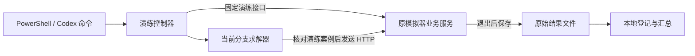

# 第三问、第四问演练自动调用

控制器已接通原模拟器内部的演练启动接口，可以连续完成开局、求解、退出、保存结果和下一局。此入口固定为演练，没有正式模式参数或正式测试绑定。

## 原理与修改范围



原版程序采用 Wails + WebView2。它的 Wails 加载器会清空 `WEBVIEW2_ADDITIONAL_BROWSER_ARGUMENTS`，普通环境变量启动不能开放调试端口；这一行为与 [Wails 加载器源码](https://github.com/wailsapp/wails/blob/master/v3/internal/webview2/webviewloader/env_create.go) 一致。

启动器在安装目录的 `.practice-control` 中准备本地副本，只替换上述环境变量名称所在的 37 字节区域，使原调试参数能够保留。替换前后分别校验固定 SHA-256，并检查其他字节完全一致。原始 EXE 不变。`WebView2Runtime` 与 `JammersSimulatorData` 通过经过路径核验的目录连接复用；副本不复制场景数据，不改变定位计算、随机场景生成、计时、身份验证或截止日期。

| 文件 | SHA-256 |
|---|---|
| 已审核原版 | `110542502401761b81f701ca1a866092e38d4ac290fa025bf18aed73ff8e9628` |
| 本地启动副本 | `aeb8827e6c5f318e31f5f7514348422ce479d8a4059b3a8c674d760c08940eaf` |

副本仍是完整模拟器，并不是独立重写的演练引擎。专用控制器只调用 `StartPractice(3或4,1000)`、`CurrentTest(1000)`、`ClearFinishedTest()`；1000 表示界面保留的反馈条数。`show` 仅显示窗口供手动登录。没有提取、绑定或调用正式测试启动方法。调试端口为本机 `127.0.0.1:19226`；它属于调试通道，控制器的调用白名单不等于给整个应用建立了安全沙盒。

## 使用

在仓库根目录执行一次依赖安装：

```powershell
.\.venv-win\Scripts\python.exe -m pip install -e '.[practice]'
```

首次启动、或者模拟器退出后重新启动：

```powershell
.\scripts\start_practice_control.ps1 -SimulatorExe '..\模拟器\数模2026\CUMCM2026B\Jammers-simulator-full\jammers-simulator-full.exe'
.\.venv-win\Scripts\python.exe -m practice_control show
```

启动器遇到已有模拟器进程会停止，要求先完成当前任务并关闭模拟器，不会接管或终止其他任务。若尚未登录，在显示的窗口手动登录一次。保持这一进程运行，后续开局由命令完成。不要在批处理期间同时用 GUI 或其他程序操作模拟器。

```powershell
# 队号只通过本地参数或环境变量提供，不填写密码。
$env:CUMCM_ROBOT_ID = '你的登录队号'

# 第三问默认 efficient，第四问默认 triangular。
.\scripts\run_practice.ps1 -Problem 3 -Repeat 10
.\scripts\run_practice.ps1 -Problem 4 -Repeat 10

# 只读状态；不会开局。
.\.venv-win\Scripts\python.exe -m practice_control status
```

其他本机目录可以用 `-SimulatorDirectory` 指定。`-Output` 必须指向尚不存在的目录。`-Variant` 选择当前代码中的策略；它与四个 Git 分支的比较不是同一个选项。四分支冻结版本的批处理见脚本 `scripts/run_four_branch_practice.ps1`。

## 四个分支批量演练

批处理使用已经归档的 v1 冻结代码、配置和模型。不会切换当前工作树，也不会把四种同名 Python 模块混在一个进程中。

| 分支来源 | 批处理标识 | 冻结提交 | 方法 |
|---|---|---|---|
| main | baseline | `2f0a486` | 固定参数 rollout |
| research/q3-state-search | state | `8aa6206` | 状态搜索与覆盖路线 |
| research/q3-deep-rl | rl | `de7d65b` | RL gae095-u512，CPU确定性推理 |
| research/q3-geometric | geo | `3c4f86f` | 几何探测与重新选点 |

```powershell
# 每种方法10局，共40局；每轮依次 baseline、state、rl、geo。
.\scripts\run_four_branch_practice.ps1 `
  -SimulatorDirectory '..\模拟器\数模2026\CUMCM2026B\Jammers-simulator-full' `
  -Repeat 10
```

默认使用同级 `q3-v1-artifacts/v1-delivery` 的配置和模型、`v1-restored-verification` 的四套冻结源码，以及 `q3-deep-rl/.venv-win` 的 Python 环境。路径可用 `-DeliveryRoot`、`-RestoredRoot`、`-PythonPath` 指定。模型和源码保留本地；新设备需要这些已归档文件。所选 Python 需有 `websocket-client`，RL 还需原先的 PyTorch 依赖。

只检查依赖与冻结版本、不开局：

```powershell
.\scripts\run_four_branch_practice.ps1 `
  -SimulatorDirectory '..\模拟器\数模2026\CUMCM2026B\Jammers-simulator-full' `
  -PreflightOnly
```

四种方法先全部通过预检，再开始第一局。每局使用新进程，保存方法名称、源码提交、配置摘要和模型哈希；任何失败都会停止后续开局。这里验证的是冻结版本，后续分支的新提交需要重新审核和登记，不能直接替换文件后沿用旧标签。

原模拟器每次演练生成新案例，四方法不会自动得到同一场景。此批处理适合重复抽样统计；本轮各一局的结果仅验证接入，不构成成对算法比较。

## 案例归属与结果

- 启动前检查明确的空闲状态；已有活动测试或正式测试状态会使演练控制器停止。
- 每局保存由启动接口返回的案例标识；每次 `/enter`、`/measure`、`/clear`、`/exit` 前再次核对演练模式、题号、案例及接口状态。
- 同一个模拟器安装目录使用操作系统互斥锁，串行运行。变更请求超时不自动重复开局；未知结果、案例变化和未正常退出都中止批次。
- 桥接层只返回公开生命周期字段，不返回事件明细或干扰源真值。求解器使用原 HTTP 测量反馈。正常退出、日志保存完成后，才读取对应案例的 `practice-p3/p4-*.result.json`，核对数量、题号和时间窗口。
- 每局保存 `created.json`、`before.json`、HTTP 请求日志、`summary.json`、`after.json` 和登记信息。批次保存在 `results/practice_batches`，包含本地汇总表；含身份信息的明文日志和 EXE 副本不提交 Git。

原 HTTP 协议不接收案例编码，因此状态检查和 HTTP 指令之间仍要求独占使用模拟器。不要同时启动另一个 GUI 客户端或求解程序。

重启后需要重新登录；未登录、网络不可用、超过原模拟器允许时间或 EXE 版本改变，都会停止。控制器不绕过这些要求。

## 2026-09-11 实测

以下均为原模拟器演练，开局由控制器直接调用完成，退出后与原结果文件核对：

| 验证 | 清除 / 总数 | 虚拟时间（秒） | 本地求解用时（秒） |
|---|---:|---:|---:|
| 第三问单局 efficient | 15/15 | 3669.076062 | 7.579 |
| 第四问单局 triangular | 15/15 | 11998.053862 | 35.766 |
| 第三问连续第1局 | 14/14 | 3764.521011 | 7.031 |
| 第三问连续第2局 | 12/12 | 3526.080631 | 8.062 |
| 四分支 baseline 冻结v1 | 15/15 | 3655.469432 | 17.187 |
| 四分支 state 冻结v1 | 16/16 | 3527.098231 | 7.828 |
| 四分支 rl 冻结v1 | 16/16 | 2996.821007 | 6.031 |
| 四分支 geo 冻结v1 | 14/14 | 3641.217284 | 11.906 |

这组实验验证自动调用流程。本地求解用时包含每条指令前的桥接检查，不含开局准备和归档；各局随机场景不同，不据此比较算法优劣或计算提速率。正式测试未使用。
